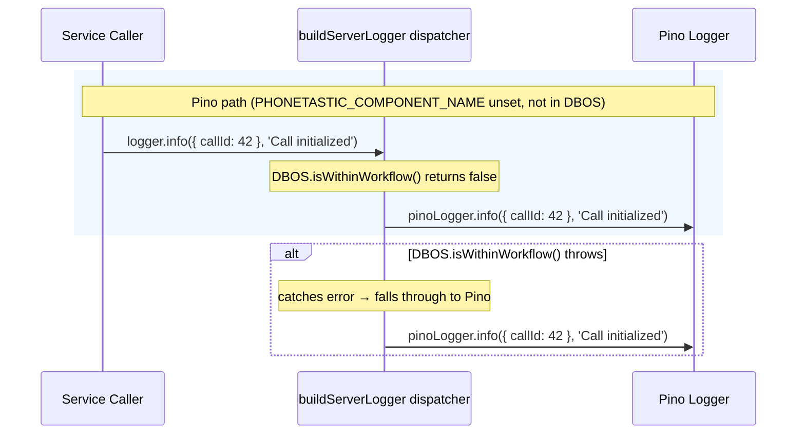
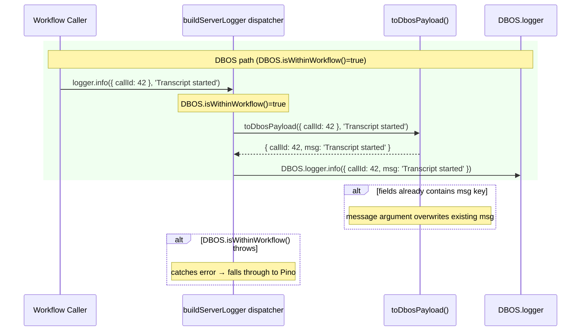
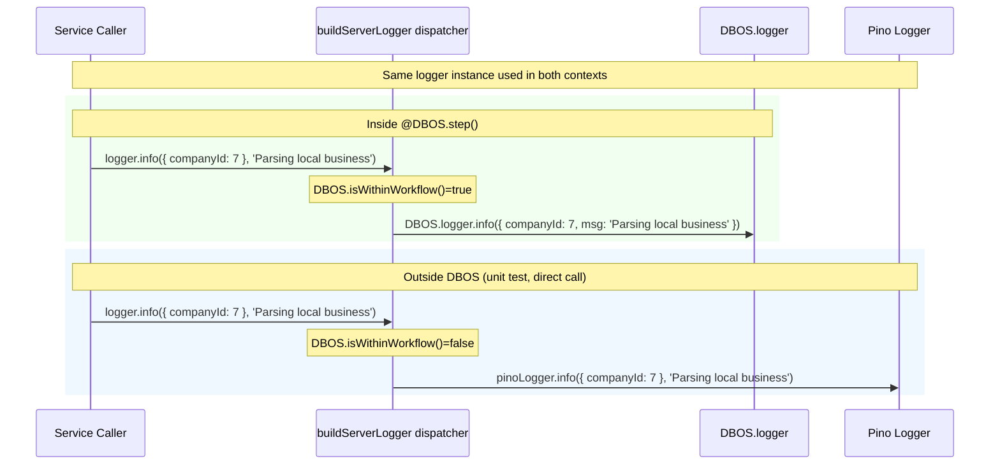
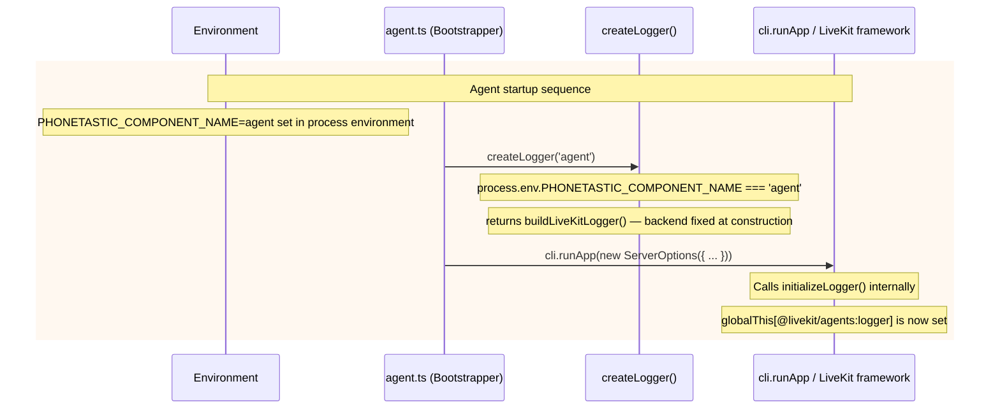
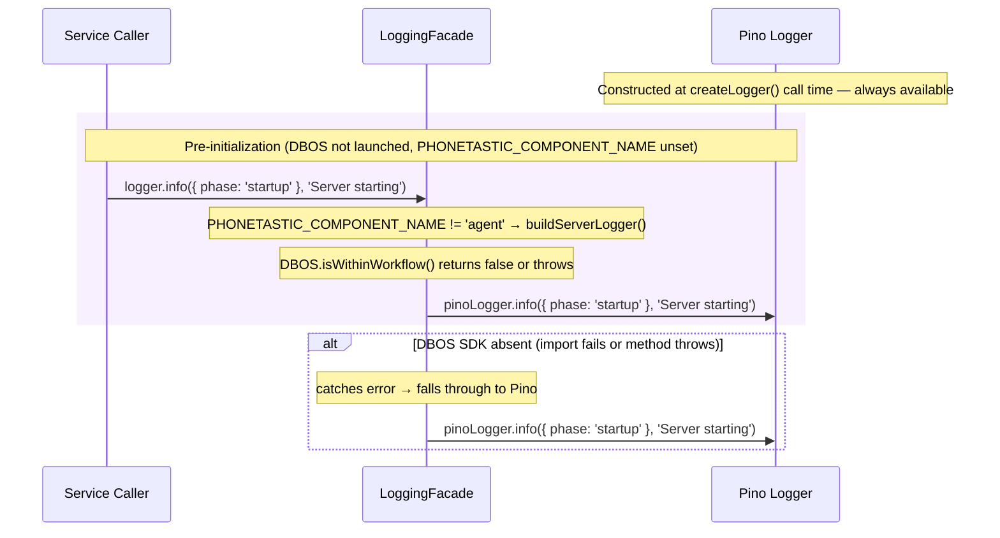
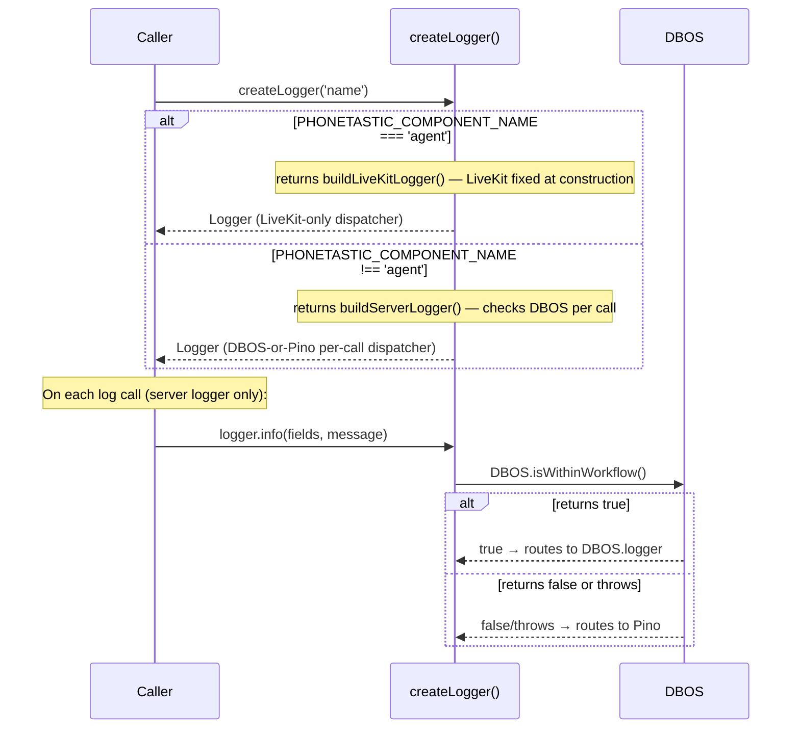

# Technical Design: Logging Facade

# Reviews

| Reviewer | Status | Feedback |
|---|---|---|
| Jordan Gaston | not_started | |

---

# Use Case Implementations

## F-01: Log from a Web Server Service



## F-02: Log from Inside a DBOS Workflow Step



## F-03: Log from a LiveKit Agent Callback

```mermaid
sequenceDiagram
    participant A as Agent Callback Caller
    participant F as buildLiveKitLogger dispatcher
    participant L as log() from @livekit/agents

    rect rgb(255, 248, 240)
    note over A,L: LiveKit path (PHONETASTIC_COMPONENT_NAME=agent at construction)
    A->>F: logger.info({ roomName: 'room-1' }, 'Connected to room')
    note over F: backend fixed at construction — always calls log()
    F->>L: log().info({ roomName: 'room-1' }, 'Connected to room')
    end

    alt log() throws TypeError (initializeLogger not yet called)
        F->>F: catches TypeError → falls back to Pino for this call
        note over F: only TypeError caught; all other errors propagate
    end
```

## F-04: Log from Code That Runs in Both DBOS and Non-DBOS Contexts



## F-05: Bootstrap Agent Process and Activate LiveKit Backend



## F-06: Log Before Any Process Initialization



## O-01: Backend Selection at Construction Time (Agent) and Call Time (Server)



---

# Tables

No new tables. The logging facade is a pure module with no persistent storage.

---

# APIs

No new HTTP endpoints. The logging facade is an internal TypeScript module.

---

# Module Design

## `src/lib/logger.ts` — complete replacement

The facade replaces the existing file at `src/lib/logger.ts`. Existing callers already import from that path; no import changes are needed.

### Exported surface

```typescript
/**
 * Unified structured logger interface satisfied by all three backends.
 * @param fields - Structured context fields attached to the log record.
 * @param message - Human-readable log message.
 */
export interface Logger {
  info(fields: object, message: string): void;
  warn(fields: object, message: string): void;
  error(fields: object, message: string): void;
  debug(fields: object, message: string): void;
}

/**
 * Creates a named logger. Backend is selected at construction time for the
 * agent process; per call for the server process.
 *
 * - LiveKit backend: when PHONETASTIC_COMPONENT_NAME=agent at construction.
 * - DBOS backend: when inside a DBOS workflow, step, or transaction (per call).
 * - Pino backend: all other cases.
 *
 * @param name - Identifier that appears in Pino records (e.g. "call-service").
 * @returns A Logger that dispatches to the correct backend.
 */
export function createLogger(name: string): Logger;
```

### Internal structure (≤10 lines per function)

```typescript
function createLogger(name: string): Logger {
  const pinoLogger = buildPinoLogger(name);
  if (process.env.PHONETASTIC_COMPONENT_NAME === 'agent') {
    return buildLiveKitLogger(pinoLogger);
  }
  return buildServerLogger(pinoLogger);
}

function buildLiveKitLogger(fallback: pino.Logger): Logger {
  const dispatch = (level: Level) => (fields: object, message: string) =>
    logViaLiveKit(level, fields, message, fallback);
  return { info: dispatch('info'), warn: dispatch('warn'), error: dispatch('error'), debug: dispatch('debug') };
}

function buildServerLogger(pinoLogger: pino.Logger): Logger {
  const dispatch = (level: Level) => (fields: object, message: string) => {
    try {
      if (DBOS.isWithinWorkflow()) return DBOS.logger[level](toDbosPayload(fields, message));
    } catch { /* not in DBOS context */ }
    pinoLogger[level](fields, message);
  };
  return { info: dispatch('info'), warn: dispatch('warn'), error: dispatch('error'), debug: dispatch('debug') };
}

function toDbosPayload(fields: object, message: string): object {
  return { ...fields, msg: message };
}

function logViaLiveKit(level: Level, fields: object, message: string, fallback: pino.Logger): void {
  try {
    log()[level](fields, message);
  } catch (err) {
    if (err instanceof TypeError) {
      fallback[level](fields, message);
    } else {
      throw err;
    }
  }
}
```

> `buildPinoLogger` contains the existing transport-selection logic. The `Level` type is `'info' | 'warn' | 'error' | 'debug'`. No module-level mutable state is required.

### DBOS DLogger level compatibility

The DBOS `DLogger` type exposes `info`, `warn`, `error`, and `debug`. All four are available; the facade calls them with the single-argument form `DLogger[level]({ msg, ...fields })`.

---

# Testing

## Test Coverage

| Use Case | Type | Unit | Integration | E2E |
|---|---|---|---|---|
| F-01: Log from a web server service | Flow | x | | |
| F-02: Log from inside a DBOS workflow step | Flow | x | | |
| F-03: Log from a LiveKit agent callback | Flow | x | | |
| F-04: Log from code in both contexts | Flow | x | | |
| F-05: Bootstrap agent process | Flow | x | | |
| F-06: Log before initialization | Flow | x | | |
| O-01: selectBackend() | Op | x | | |
| O-02: toDbosPayload() | Op | x | | |

All tests are unit tests. The facade has no I/O dependencies of its own; it delegates to backends. Testing integration with actual Pino, DBOS, and LiveKit output is out of scope for this document.

## Test Approach

### Unit Tests

**Pino path** — test two cases:
1. `PHONETASTIC_COMPONENT_NAME` unset, `DBOS.isWithinWorkflow()=false` → routes to Pino
2. `DBOS.isWithinWorkflow()` throws → falls back to Pino

**DBOS path** — test two cases:
1. `DBOS.isWithinWorkflow()=true` → routes to `DBOS.logger`
2. Message argument overwrites an existing `msg` field in fields

**LiveKit path** — test four cases:
1. `PHONETASTIC_COMPONENT_NAME=agent` → routes to `log()` backend
2. `PHONETASTIC_COMPONENT_NAME=agent` takes priority over `DBOS.isWithinWorkflow()=true`
3. `log()[level]` throws `TypeError` → falls back to Pino
4. `log()[level]` throws non-TypeError → error propagates

**Single-argument form** — test two cases:
1. `logger.info('msg')` (no fields) → routes to Pino without error
2. `logger.info('msg')` when in DBOS workflow → `DBOS.logger` receives `{ msg: 'msg' }`

**`toDbosPayload()`** — test two cases:
1. Fields + message → `{ ...fields, msg: message }`
2. Fields already contains `msg` key → message argument overwrites it

### Integration Tests

None required. The facade delegates immediately to its backends; there are no component boundaries to cross that are not covered by unit tests.

### End-to-End Tests

None required. Log output correctness is the responsibility of each backend (Pino, DBOS, LiveKit), not the facade.

## Test Infrastructure

**Env var isolation.** `PHONETASTIC_COMPONENT_NAME` is read directly from `process.env`. Because `vitest` runs tests in `singleFork` mode (all tests share one process), tests that set this env var must restore it in describe-scoped `afterEach`. Module-level state and `_resetForTesting()` exports are not required.

**Mocking `DBOS.isWithinWorkflow`.** Mock via `vi.mock('@dbos-inc/dbos-sdk', () => ({ DBOS: { isWithinWorkflow: vi.fn(), logger: { ... } } }))`. Call `vi.clearAllMocks()` in `beforeEach`.

**Mocking `log()` from `@livekit/agents`.** Mock via `vi.mock('@livekit/agents', () => ({ log: vi.fn() }))`. Configure `mockLog.mockReturnValue({ info: spy, ... })` per test.

---

# Deployment

## Migrations

None. The facade is a pure module replacement; it adds no schema changes and no data migrations.

## Deploy Sequence

The facade ships as part of a single deploy. No ordering constraint exists between the web server and agent deploys, because the module change is purely additive from the perspective of callers.

## Rollback Plan

Roll back by reverting the commit. The change is isolated to `src/lib/logger.ts` and call sites in `src/agent/callbacks/` and `src/workflows/`. No database state is involved.

---

# Monitoring

## Metrics

None. The facade adds no new metrics. Each backend (Pino with OTLP, DBOS logger) handles its own observability.

## Alerts

None specific to this feature.

## Dashboards

None. Existing log dashboards remain unchanged; structured log fields are the same as before.

## Logging

The facade itself does not log. It is the logging primitive; it has no logger of its own.

---

# Decisions

## Replace `src/lib/logger.ts` entirely rather than adding a parallel file

**Framework:** Direct criterion — single dominant constraint.

Callers throughout the codebase already import from `src/lib/logger.ts`. Replacing the file in place means zero import-site changes for `createLogger` callers. A parallel file would require updating every existing import and would leave two logging entry points, increasing the chance of callers bypassing the facade.

**Choice:** Replace the file in place. The `Logger` interface and `createLogger` signature remain backward-compatible.

### Alternatives Considered
- **Add `src/lib/logging-facade.ts` alongside the existing file:** Requires updating all existing imports; leaves two entry points; rejected.

---

## Use PHONETASTIC_COMPONENT_NAME env var to identify the agent process

**Framework:** Direct criterion — the detection mechanism must not itself throw or produce false positives.

`log()` throws `TypeError` when the LiveKit logger is uninitialized. Calling `log()` to test availability would trigger that throw in non-agent processes. A process environment variable set before any logger is created is cheaper, clearer, and more idiomatic than a module-level flag or SDK internals.

**Choice:** `process.env.PHONETASTIC_COMPONENT_NAME === 'agent'` checked once at `createLogger` construction time.

### Alternatives Considered
- **Module-level `IS_LIVEKIT_AGENT` flag with `markAsLiveKitAgent()`:** Requires a side-effecting export and a `_resetForTesting()` escape hatch; env vars are cleaner.
- **Check `globalThis[Symbol.for('@livekit/agents:logger')]` directly:** Relies on an `@internal` symbol; fragile against SDK changes; rejected.
- **Try/catch `log()` on every call to detect availability:** Expensive on the hot path; throws as control flow; rejected.

---

## Select the agent backend once at construction; check DBOS per call

**Framework:** Direct criterion — `PHONETASTIC_COMPONENT_NAME` is set before any logger is created (agent startup), but the same logger instance may be called from both DBOS and non-DBOS contexts.

The agent process sets `PHONETASTIC_COMPONENT_NAME=agent` before any module executes, so reading it at `createLogger` time is always correct. The DBOS context changes per call (the same logger may be used inside and outside a workflow), so that check must remain per-call.

**Choice:** `createLogger` returns `buildLiveKitLogger()` when `PHONETASTIC_COMPONENT_NAME=agent`; otherwise returns `buildServerLogger()` which checks `DBOS.isWithinWorkflow()` on each invocation.

### Alternatives Considered
- **Full per-call backend selection:** Redundant for the LiveKit path; the env var never changes during process lifetime.
- **Full construction-time selection:** Cannot support shared code that runs in both DBOS and non-DBOS contexts; rejected.

---

## Guard `log()` with a TypeError-specific catch, not a broad catch

**Framework:** Direct criterion — non-TypeError errors from `log()` indicate a real failure and must propagate.

The only expected reason `log()` throws during agent startup is the brief window before `initializeLogger()` is called by the LiveKit framework. That window produces a `TypeError`. Any other error (e.g., a corrupted logger state) indicates a real problem. A broad catch would silently swallow those failures.

**Choice:** Catch `TypeError` only; re-throw everything else.

### Alternatives Considered
- **Broad try/catch around `log()` call:** Silently swallows real errors; rejected.
- **No catch at all:** Crashes the agent process on the brief init window; rejected.

---

# Open Questions

| ID | Question | Status | Resolution |
|---|---|---|---|
| Q-01 | Does DBOS automatically correlate log output with the active workflow ID, or must callers include `workflowID` in fields? | open | |
| Q-02 | Should `createLogger` skip constructing the Pino instance in DBOS and agent contexts to avoid allocating an unused logger? | open | |
| Q-03 | Should the facade expose `.child(fields)` for binding per-request context (e.g., `callId`, `companyId`) to every subsequent call? | open | |

---

# Migration Guide

## Existing `createLogger` callers (`src/server.ts`, `src/services/call-service.ts`, parsers)

No changes required. These callers already use `createLogger(name)` and `logger.info(fields, message)`. The facade preserves that signature.

## Agent callbacks (`src/agent/callbacks/`, `src/agent/call-entry-handler.ts`)

Replace `log()` calls with an instance-variable facade logger. No changes to `agent.ts` are required; the process must have `PHONETASTIC_COMPONENT_NAME=agent` set in the environment before startup.

Before:
```typescript
import { log } from '@livekit/agents';
log().info({ roomName }, 'Connected to room');
```

After:
```typescript
import { createLogger } from '../../lib/logger.js';
export class SomeCallback {
  private readonly logger = createLogger('some-callback');
  run(): void {
    this.logger.info({ roomName }, 'Connected to room');
  }
}
```

## DBOS workflows (`src/workflows/`)

Replace `DBOS.logger` calls with a facade logger. The message moves from the `msg` field to the second argument.

Before:
```typescript
DBOS.logger.info({ msg: 'SummarizeCallTranscript started', callId });
```

After:
```typescript
import { createLogger } from '../lib/logger.js';
const logger = createLogger('summarize-call');
logger.info({ callId }, 'SummarizeCallTranscript started');
```

---

# Appendix A — Changelog

| Date | Author | Change |
|---|---|---|
| 2026-04-02 | Jordan Gaston | Initial draft |
