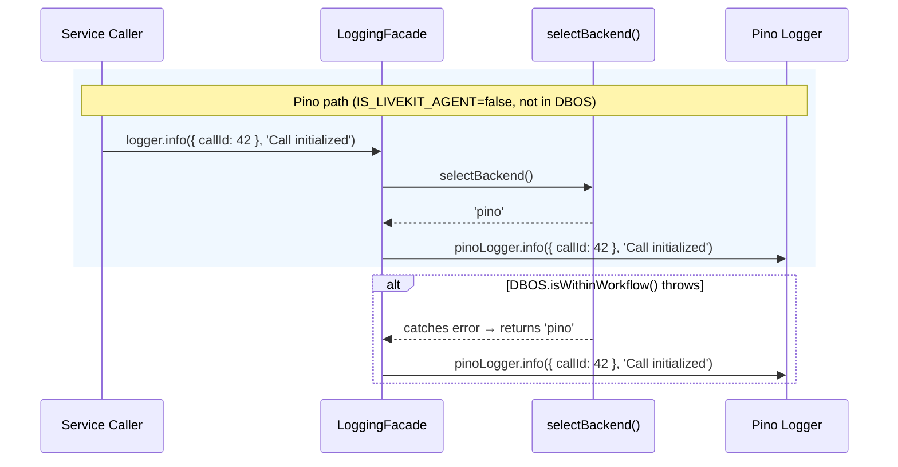
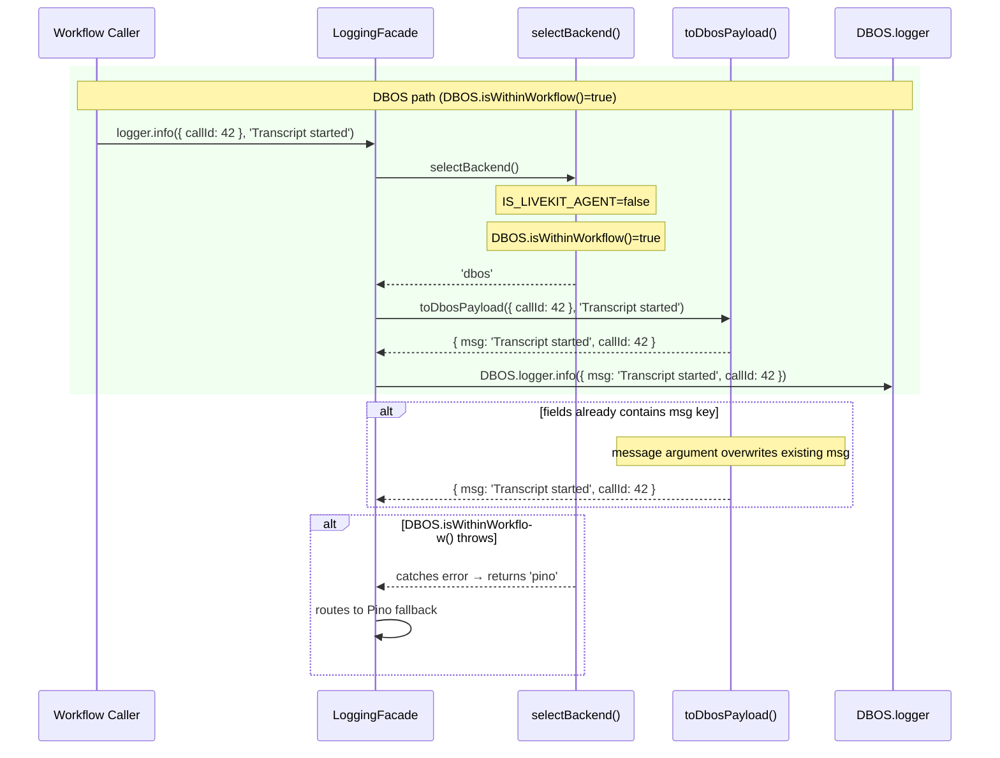
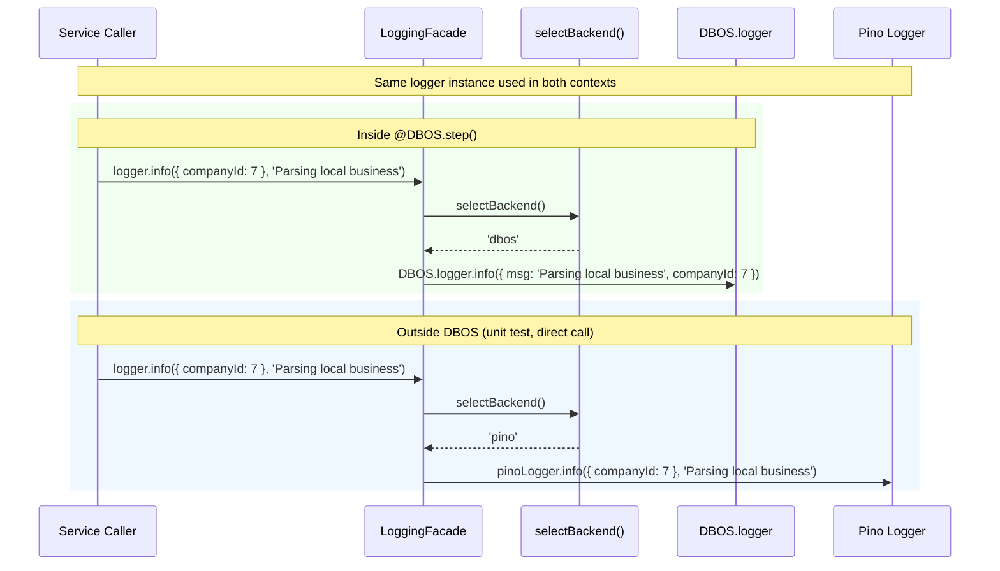
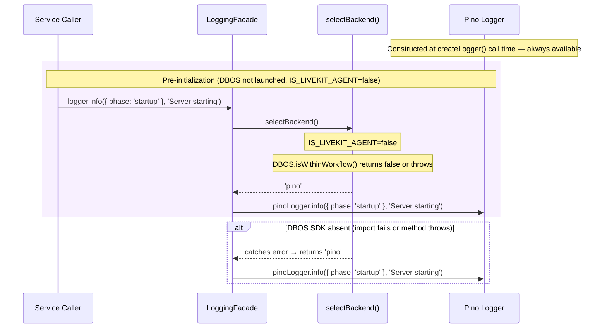

# Technical Design: Logging Facade

# Reviews

| Reviewer | Status | Feedback |
|---|---|---|
| Jordan Gaston | not_started | |

---

# Use Case Implementations

## F-01: Log from a Web Server Service



## F-02: Log from Inside a DBOS Workflow Step



## F-03: Log from a LiveKit Agent Callback

```mermaid
sequenceDiagram
    participant A as Agent Callback Caller
    participant F as LoggingFacade
    participant O as selectBackend()
    participant L as log() from @livekit/agents

    rect rgb(255, 248, 240)
    note over A,L: LiveKit path (IS_LIVEKIT_AGENT=true)
    A->>F: logger.info({ roomName: 'room-1' }, 'Connected to room')
    F->>O: selectBackend()
    note over O: IS_LIVEKIT_AGENT=true — check first
    O-->>F: 'livekit'
    F->>L: log().info({ roomName: 'room-1' }, 'Connected to room')
    end

    alt log() throws TypeError (initializeLogger not yet called)
        F->>F: catches TypeError → falls back to Pino for this call
        note over F: only TypeError caught; all other errors propagate
    end
```

## F-04: Log from Code That Runs in Both DBOS and Non-DBOS Contexts



## F-05: Bootstrap Agent Process and Activate LiveKit Backend

```mermaid
sequenceDiagram
    participant B as agent.ts (Bootstrapper)
    participant F as LoggingFacade module
    participant LK as cli.runApp / LiveKit framework

    rect rgb(255, 248, 240)
    note over B,LK: Agent startup sequence
    B->>F: markAsLiveKitAgent()
    note over F: IS_LIVEKIT_AGENT = true (module-level; irreversible)
    B->>LK: cli.runApp(new ServerOptions({ ... }))
    note over LK: Calls initializeLogger() internally
    note over LK: globalThis[@livekit/agents:logger] is now set
    end

    alt markAsLiveKitAgent() called more than once
        note over F: flag already true; no-op; no error
    end
```

## F-06: Log Before Any Process Initialization



## O-01: selectBackend() — Implements O-01: Select Logging Backend at Call Time

```mermaid
sequenceDiagram
    participant F as LoggingFacade
    participant O as selectBackend()
    participant D as DBOS

    F->>O: selectBackend()

    alt IS_LIVEKIT_AGENT is true
        O-->>F: 'livekit'
    else DBOS.isWithinWorkflow() returns true
        O->>D: DBOS.isWithinWorkflow()
        D-->>O: true
        O-->>F: 'dbos'
    else DBOS.isWithinWorkflow() returns false
        O->>D: DBOS.isWithinWorkflow()
        D-->>O: false
        O-->>F: 'pino'
    else DBOS.isWithinWorkflow() throws
        O->>D: DBOS.isWithinWorkflow()
        D-->>O: throws
        note over O: catches error; treats as false
        O-->>F: 'pino'
    end
```

---

# Tables

No new tables. The logging facade is a pure module with no persistent storage.

---

# APIs

No new HTTP endpoints. The logging facade is an internal TypeScript module.

---

# Module Design

## `src/lib/logger.ts` — complete replacement

The facade replaces the existing file at `src/lib/logger.ts`. Existing callers already import from that path; no import changes are needed.

### Exported surface

```typescript
/** Unified structured logger interface. All backends satisfy this contract. */
export interface Logger {
  info(fields: object, message: string): void;
  warn(fields: object, message: string): void;
  error(fields: object, message: string): void;
  debug(fields: object, message: string): void;
}

/**
 * Creates a named logger. In the Pino path, name appears in every record.
 * In DBOS and LiveKit paths, name is ignored; those backends own their own context.
 *
 * @param name - Identifier that appears in Pino records (e.g. "call-service").
 * @returns A Logger that routes each call to the correct backend at call time.
 */
export function createLogger(name: string): Logger;

/**
 * Marks the current process as a LiveKit agent.
 * Call once at the top of agent.ts before any log call.
 * The flag is process-scoped and cannot be unset.
 *
 * @postcondition All subsequent facade log calls route to the LiveKit backend.
 */
export function markAsLiveKitAgent(): void;
```

### Internal structure (≤10 lines per function)

```typescript
// Module-level state
let IS_LIVEKIT_AGENT = false;

function markAsLiveKitAgent(): void {
  IS_LIVEKIT_AGENT = true;
}

function selectBackend(): 'livekit' | 'dbos' | 'pino' {
  if (IS_LIVEKIT_AGENT) return 'livekit';
  try {
    return DBOS.isWithinWorkflow() ? 'dbos' : 'pino';
  } catch {
    return 'pino';
  }
}

function toDbosPayload(fields: object, message: string): object {
  return { msg: message, ...fields };
}

function logViaLiveKit(level: Level, fields: object, message: string): void {
  try {
    log()[level](fields, message);
  } catch (err) {
    if (err instanceof TypeError) {
      getPinoLogger().info(fields, message);  // fallback only for init race
    } else {
      throw err;
    }
  }
}

function createLogger(name: string): Logger {
  const pino = buildPinoLogger(name);
  const dispatch = (level: Level) => (fields: object, message: string) => {
    const backend = selectBackend();
    if (backend === 'livekit') return logViaLiveKit(level, fields, message);
    if (backend === 'dbos') return DBOS.logger[level](toDbosPayload(fields, message));
    pino[level](fields, message);
  };
  return { info: dispatch('info'), warn: dispatch('warn'), error: dispatch('error'), debug: dispatch('debug') };
}
```

> `buildPinoLogger` contains the existing transport-selection logic extracted from the current `createLogger` implementation. The `Level` type is `'info' | 'warn' | 'error' | 'debug'`.

### DBOS DLogger level compatibility

The DBOS `DLogger` type exposes `info`, `warn`, `error`, and `debug`. All four are available; the facade calls them with the single-argument form `DLogger[level]({ msg, ...fields })`.

---

# Testing

## Test Coverage

| Use Case | Type | Unit | Integration | E2E |
|---|---|---|---|---|
| F-01: Log from a web server service | Flow | x | | |
| F-02: Log from inside a DBOS workflow step | Flow | x | | |
| F-03: Log from a LiveKit agent callback | Flow | x | | |
| F-04: Log from code in both contexts | Flow | x | | |
| F-05: Bootstrap agent process | Flow | x | | |
| F-06: Log before initialization | Flow | x | | |
| O-01: selectBackend() | Op | x | | |
| O-02: toDbosPayload() | Op | x | | |

All tests are unit tests. The facade has no I/O dependencies of its own; it delegates to backends. Testing integration with actual Pino, DBOS, and LiveKit output is out of scope for this document.

## Test Approach

### Unit Tests

**`selectBackend()`** — test all six branches:
1. `IS_LIVEKIT_AGENT=true` → returns `'livekit'`
2. `IS_LIVEKIT_AGENT=false`, `DBOS.isWithinWorkflow()=true` → returns `'dbos'`
3. `IS_LIVEKIT_AGENT=false`, `DBOS.isWithinWorkflow()=false` → returns `'pino'`
4. `IS_LIVEKIT_AGENT=false`, `DBOS.isWithinWorkflow()` throws → returns `'pino'`
5. `IS_LIVEKIT_AGENT=true` takes priority over `DBOS.isWithinWorkflow()=true`

Mock `DBOS.isWithinWorkflow` via module-level substitution. Reset `IS_LIVEKIT_AGENT` between tests.

**`toDbosPayload()`** — test three cases:
1. Normal fields object → `{ msg: message, ...fields }`
2. Fields already contains `msg` → message argument overwrites it
3. Non-object fields (e.g., `undefined`) → `{ msg: message, value: undefined }`

No mocks needed; pure function.

**`markAsLiveKitAgent()`** — test two cases:
1. Sets `IS_LIVEKIT_AGENT` to true
2. Calling it a second time leaves it true without error

**`createLogger()` routing** — test one case per backend path using a spy on each backend:
1. Pino path: spy on `pinoLogger.info`; assert it receives `(fields, message)`
2. DBOS path: spy on `DBOS.logger.info`; assert it receives `{ msg: message, ...fields }`
3. LiveKit path: spy on `log().info`; assert it receives `(fields, message)`

**LiveKit TypeError fallback** — test that when `log()` throws `TypeError`, the call falls back to Pino rather than propagating.

**LiveKit non-TypeError propagation** — test that when `log()` throws a non-TypeError, the error propagates to the caller.

### Integration Tests

None required. The facade delegates immediately to its backends; there are no component boundaries to cross that are not covered by unit tests.

### End-to-End Tests

None required. Log output correctness is the responsibility of each backend (Pino, DBOS, LiveKit), not the facade.

## Test Infrastructure

**Resetting module-level state between tests.** `IS_LIVEKIT_AGENT` is a module-level `let`. Tests that call `markAsLiveKitAgent()` must reset the flag afterward. Two options:

- Export a `_resetForTesting()` function visible only in test environments (preferred — no production surface area change)
- Use `jest.resetModules()` to reload the module between tests (slower but requires no export)

The `_resetForTesting()` export approach is preferred. Mark it with a JSDoc `@internal` tag.

**Mocking `DBOS.isWithinWorkflow`.**  Mock via `jest.spyOn(DBOS, 'isWithinWorkflow')`. Restore after each test.

**Mocking `log()` from `@livekit/agents`.** Mock via `jest.mock('@livekit/agents', () => ({ log: jest.fn() }))`. Configure the mock to return a spy object with `info`, `warn`, `error`, `debug` methods.

---

# Deployment

## Migrations

None. The facade is a pure module replacement; it adds no schema changes and no data migrations.

## Deploy Sequence

The facade ships as part of a single deploy. No ordering constraint exists between the web server and agent deploys, because the module change is purely additive from the perspective of callers.

## Rollback Plan

Roll back by reverting the commit. The change is isolated to `src/lib/logger.ts` and call sites in `src/agent/callbacks/` and `src/workflows/`. No database state is involved.

---

# Monitoring

## Metrics

None. The facade adds no new metrics. Each backend (Pino with OTLP, DBOS logger) handles its own observability.

## Alerts

None specific to this feature.

## Dashboards

None. Existing log dashboards remain unchanged; structured log fields are the same as before.

## Logging

The facade itself does not log. It is the logging primitive; it has no logger of its own.

---

# Decisions

## Replace `src/lib/logger.ts` entirely rather than adding a parallel file

**Framework:** Direct criterion — single dominant constraint.

Callers throughout the codebase already import from `src/lib/logger.ts`. Replacing the file in place means zero import-site changes for `createLogger` callers. A parallel file would require updating every existing import and would leave two logging entry points, increasing the chance of callers bypassing the facade.

**Choice:** Replace the file in place. The `Logger` interface and `createLogger` signature remain backward-compatible.

### Alternatives Considered
- **Add `src/lib/logging-facade.ts` alongside the existing file:** Requires updating all existing imports; leaves two entry points; rejected.

---

## Use a process-level flag rather than detecting LiveKit context from globalThis directly

**Framework:** Direct criterion — the detection mechanism must not itself throw or produce false positives.

`log()` throws `TypeError` when the LiveKit logger is uninitialized. Calling `log()` to test whether the LiveKit backend is available would trigger that throw in non-agent processes. A process-level flag set once at agent startup is cheaper, clearer, and does not depend on `globalThis` internals that are `@internal` in the LiveKit SDK.

**Choice:** `IS_LIVEKIT_AGENT` module-level flag set by `markAsLiveKitAgent()` in `agent.ts`.

### Alternatives Considered
- **Check `globalThis[Symbol.for('@livekit/agents:logger')]` directly:** Relies on an `@internal` symbol; fragile against SDK changes; rejected.
- **Try/catch `log()` on every call to detect availability:** Expensive on the hot path; throws as control flow; rejected.

---

## Route backend selection at call time, not construction time

**Framework:** Direct criterion — the same logger instance must work in both DBOS and non-DBOS execution paths.

Code like `local-business-parser.ts` runs inside `@DBOS.step()` in production and outside it in unit tests. If the facade chose a backend at `createLogger` time, the same logger would be locked to Pino forever, even when called from within a DBOS step. Call-time selection solves this without requiring callers to construct separate loggers per context.

**Choice:** `selectBackend()` is called on every log invocation.

### Alternatives Considered
- **Construct-time backend selection:** Cannot support shared code that runs in multiple contexts; rejected.
- **Per-context factory functions (e.g., `createWorkflowLogger()`):** Forces callers to know their context; rejected.

---

## Guard `log()` with a TypeError-specific catch, not a broad catch

**Framework:** Direct criterion — non-TypeError errors from `log()` indicate a real failure and must propagate.

The only expected reason `log()` throws in normal agent operation is a brief race between `markAsLiveKitAgent()` being set and `initializeLogger()` being called by the LiveKit framework. That race produces a `TypeError`. Any other error (e.g., a corrupted logger state) indicates a real problem. A broad catch would silently swallow those failures.

**Choice:** Catch `TypeError` only; re-throw everything else.

### Alternatives Considered
- **Broad try/catch around `log()` call:** Silently swallows real errors; rejected.
- **No catch at all:** Crashes the agent process on the brief init race; rejected.

---

# Open Questions

| ID | Question | Status | Resolution |
|---|---|---|---|
| Q-01 | Does DBOS automatically correlate log output with the active workflow ID, or must callers include `workflowID` in fields? | open | |
| Q-02 | Should `createLogger` skip constructing the Pino instance in DBOS and agent contexts to avoid allocating an unused logger? | open | |
| Q-03 | Should the facade expose `.child(fields)` for binding per-request context (e.g., `callId`, `companyId`) to every subsequent call? | open | |

---

# Migration Guide

## Existing `createLogger` callers (`src/server.ts`, `src/services/call-service.ts`, parsers)

No changes required. These callers already use `createLogger(name)` and `logger.info(fields, message)`. The facade preserves that signature.

## Agent callbacks (`src/agent/callbacks/`, `src/agent/call-entry-handler.ts`)

Replace `log()` calls with a facade logger. Add `markAsLiveKitAgent()` call to `agent.ts`.

Before:
```typescript
import { log } from '@livekit/agents';
log().info({ roomName }, 'Connected to room');
```

After:
```typescript
import { createLogger } from './lib/logger.js';
const logger = createLogger('call-entry-handler');
logger.info({ roomName }, 'Connected to room');
```

In `agent.ts`, add before any other call:
```typescript
import { markAsLiveKitAgent } from './lib/logger.js';
markAsLiveKitAgent();
```

## DBOS workflows (`src/workflows/`)

Replace `DBOS.logger` calls with a facade logger. The message moves from the `msg` field to the second argument.

Before:
```typescript
DBOS.logger.info({ msg: 'SummarizeCallTranscript started', callId });
```

After:
```typescript
import { createLogger } from '../lib/logger.js';
const logger = createLogger('summarize-call');
logger.info({ callId }, 'SummarizeCallTranscript started');
```

---

# Appendix A — Changelog

| Date | Author | Change |
|---|---|---|
| 2026-04-02 | Jordan Gaston | Initial draft |
