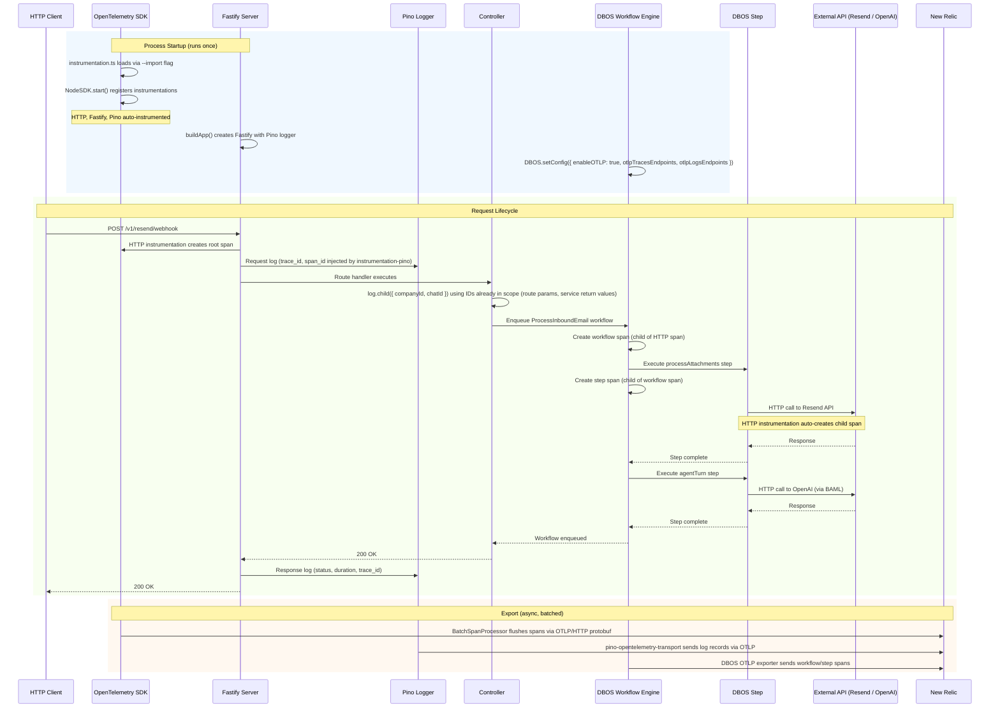
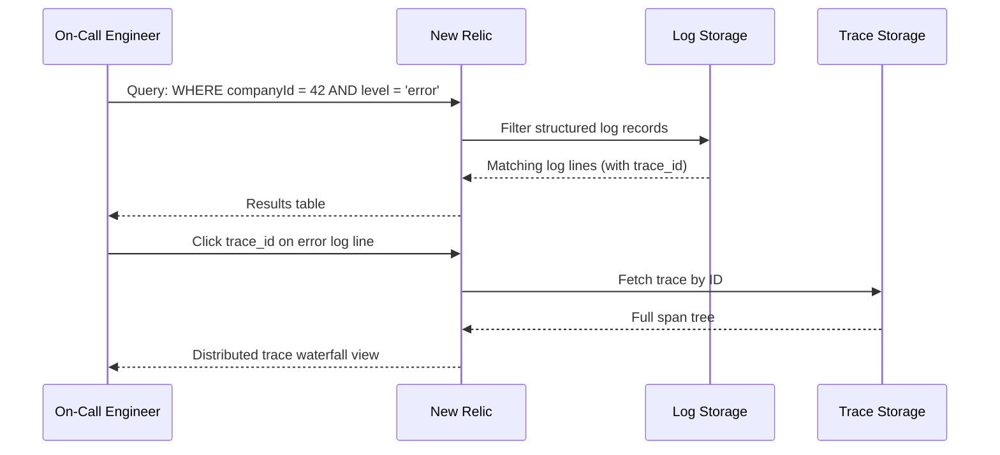

# Reviews

| Reviewer | Status | Feedback |
|---|---|---|
| Jordan | not_started | |

---

# Use Case Implementations

## Web Server Request Tracing -- Implements F-01: Trace an API Request Through Workflows



---

## Voice Call Tracing -- Implements F-02: Trace a Voice Call Through the Agent Pipeline *(Deferred)*

> **Deferred.** The LiveKit agents Node.js SDK (v1.0.50) owns the agent logging pipeline via its `log()` function. Replacing it with Pino risks breaking SDK-internal logging and cannot be safely validated without end-to-end agent integration tests. This section retains the original design for future reference. Implementation will be revisited when the LiveKit Node.js SDK exposes `set_tracer_provider` or when an agent test harness exists.

---

## Log Query by Entity -- Implements F-03: Search Logs for a Specific Company or Call



No new system components required. This flow works because F-01 and F-02 ensure logs carry entity IDs and trace_id fields.

---

## OTEL SDK Initialization -- Implements O-01: Initialize OpenTelemetry SDK

```mermaid
sequenceDiagram
    participant Entry as Entry Point (server.ts / agent.ts)
    participant Inst as instrumentation.ts
    participant SDK as NodeSDK
    participant Exp as OTLP Exporters
    participant Env as Environment Variables

    Entry->>Inst: --import ./src/instrumentation.ts (loads first)
    Inst->>Env: Read OTEL_EXPORTER_OTLP_ENDPOINT
    alt Endpoint configured
        Inst->>Exp: Create OTLPTraceExporter + OTLPLogExporter
        Inst->>SDK: new NodeSDK({ traceExporter, logRecordProcessor, instrumentations })
        SDK->>SDK: Register HTTP, Fastify, Pino instrumentations
        SDK->>SDK: start()
    else No endpoint
        Inst->>Inst: Log "OTLP not configured, skipping"
        note over Inst: No-op; server starts without export
    end
    Entry->>Entry: Continue normal startup
```

---

# Tables

No new database tables are required. Observability data flows to New Relic, not to PostgreSQL.

---

# APIs

No new HTTP endpoints are introduced. This design adds instrumentation to existing endpoints.

---

# File Structure

## New Files

| File | Purpose |
|---|---|
| `src/instrumentation.ts` | OpenTelemetry SDK initialization; loaded before all other code via `--import` flag |
| `src/lib/logger.ts` | Pino logger factory; creates the base logger with OTEL transport (production) or pretty-print (development) |

## Modified Files

| File | Change |
|---|---|
| `src/server.ts` | Replace `console.log`/`console.error` with Pino logger; pass logger to `buildApp()` |
| `src/app.ts` | Accept external Pino logger instead of creating one inline |
| `src/agent.ts` | Add manual spans for agent session lifecycle; create child loggers with call context |
| `src/config/env.ts` | Add OTEL-related env var validation |
| `src/middleware/error-handler.ts` | Log unhandled errors with structured context |
| `src/workflows/*.ts` | Add structured log lines at workflow and step boundaries using `DBOS.logger` |
| `package.json` | Add new dependencies |

---

# Component Design

## src/instrumentation.ts

This file initializes the OpenTelemetry SDK and must execute before any other application code. It is loaded via Node.js's `--import` flag in the start scripts.

**Behavior:**

1. Read `OTEL_EXPORTER_OTLP_ENDPOINT` from environment. If absent, log to stderr and return (no-op).
2. Create an `OTLPTraceExporter` using HTTP/protobuf protocol. The endpoint, headers, and protocol are read from standard OTEL environment variables (`OTEL_EXPORTER_OTLP_ENDPOINT`, `OTEL_EXPORTER_OTLP_HEADERS`, `OTEL_EXPORTER_OTLP_PROTOCOL`).
3. Create an `OTLPLogExporter` using the same endpoint configuration.
4. Create a `NodeSDK` with:
   - `traceExporter`: the OTLP trace exporter
   - `logRecordProcessor`: a `BatchLogRecordProcessor` wrapping the log exporter
   - `instrumentations`: array containing `HttpInstrumentation`, `FastifyInstrumentation` (web process only), and `PinoInstrumentation`
   - `resource`: with `service.name` set to `phonetastic-web` or `phonetastic-agent` based on an env var
5. Call `sdk.start()`.
6. Register a shutdown hook: `process.on('SIGTERM', () => sdk.shutdown())`.

**Environment variables consumed (all standard OTEL):**

| Variable | Required | Default | Notes |
|---|---|---|---|
| `OTEL_EXPORTER_OTLP_ENDPOINT` | No | (none; disables export) | e.g., `https://otlp.nr-data.net:4318` |
| `OTEL_EXPORTER_OTLP_HEADERS` | No | (none) | e.g., `api-key=YOUR_NR_LICENSE_KEY` |
| `OTEL_EXPORTER_OTLP_PROTOCOL` | No | `http/protobuf` | Recommended for New Relic |
| `OTEL_SERVICE_NAME` | No | `phonetastic` | Distinguishes web vs agent in NR |

**Packages required:**

```
@opentelemetry/sdk-node
@opentelemetry/exporter-trace-otlp-proto
@opentelemetry/exporter-logs-otlp-proto
@opentelemetry/sdk-logs
@opentelemetry/auto-instrumentations-node
@opentelemetry/instrumentation-pino
@opentelemetry/instrumentation-http
@opentelemetry/instrumentation-fastify
@opentelemetry/api
```

**Why a separate file loaded via `--import`:** The OpenTelemetry SDK must patch modules (http, pino, fastify) before they are first imported. If initialization happens inside `server.ts` after imports, the monkey-patching fails and instrumentation is silently broken. The `--import` flag guarantees execution order.

---

## src/lib/logger.ts

A factory that creates the base Pino logger instance used by the Fastify server.

**Behavior:**

1. In production (`NODE_ENV=production`): create a Pino instance with `pino-opentelemetry-transport` as a transport target. This sends log records to New Relic as OTEL log signals. Simultaneously, `@opentelemetry/instrumentation-pino` (registered in `instrumentation.ts`) injects `trace_id`, `span_id`, and `trace_flags` into every log record.
2. In development: create a Pino instance with `pino-pretty` transport for human-readable console output. Trace context is still injected by instrumentation-pino (visible as fields in pretty output).
3. Export a `createLogger(name: string)` function that returns a configured Pino instance.

**Why both `pino-opentelemetry-transport` and `@opentelemetry/instrumentation-pino`:** They serve different purposes. `instrumentation-pino` injects trace context INTO log records (so logs carry trace_id). `pino-opentelemetry-transport` sends log records TO an OTEL collector. You need both: trace context in logs AND logs sent as OTEL signals.

**Packages required:**

```
pino
pino-pretty (dev dependency)
pino-opentelemetry-transport
```

---

## DBOS Configuration

DBOS has its own OTEL integration via `@dbos-inc/otel`. When enabled, it automatically creates spans for every `@DBOS.workflow()` and `@DBOS.step()` call and exports them via OTLP.

**Changes to `src/server.ts`:**

```typescript
DBOS.setConfig({
  name: 'phonetastic',
  databaseUrl: buildDbUrl(),
  runAdminServer: false,
  enableOTLP: true,
  otlpTracesEndpoints: [process.env.OTEL_EXPORTER_OTLP_ENDPOINT + '/v1/traces'].filter(Boolean),
  otlpLogsEndpoints: [process.env.OTEL_EXPORTER_OTLP_ENDPOINT + '/v1/logs'].filter(Boolean),
});
```

**Why configure DBOS separately:** DBOS runs its own OTLP exporter internally. It does not use the NodeSDK's exporter. Both must point to the same New Relic endpoint so traces from HTTP instrumentation and DBOS workflow spans end up in the same trace.

**Package required:**

```
@dbos-inc/otel
```

---

## Agent Process Instrumentation *(Deferred)*

> **Deferred.** The LiveKit agents Node.js SDK (v1.0.50) owns the agent logging pipeline via its `log()` function. Replacing it with Pino risks breaking SDK-internal logging and cannot be safely validated without end-to-end agent integration tests. The `instrumentation.ts` file already excludes Fastify instrumentation for non-web services, so the groundwork is in place. Implementation will be revisited when the LiveKit Node.js SDK exposes `set_tracer_provider` or when an agent test harness exists.

---

## Structured Log Fields

All log lines in the web server process use consistent field names. Fields are set via Pino child loggers at the appropriate scope.

**Rule (BR-03): Never query the database to populate log context.** Only attach entity IDs that are already in scope — from request parameters, workflow arguments, session state, or variables the code already holds. If a code path does not have a `companyId`, the log line omits it. This is acceptable; the `trace_id` links the log to a trace where the full context is visible.

### Web Server Log Fields

| Scope | How Set | Fields | Source of truth |
|---|---|---|---|
| Request | Fastify request + auth middleware | `reqId`, `method`, `url`, `userId` | `request.userId` from JWT; `reqId` from Fastify |
| Controller | Child logger from route params/body | `companyId` (when in route or resolved by service), `chatId`, `emailId` | Only what the controller already has from params or service return values |
| Workflow | DBOS.logger (auto-attached by DBOS) | `workflowId`, `workflowName` | DBOS runtime |
| Workflow steps | Step args passed to the workflow | Entity IDs from workflow arguments (e.g., `chatId`, `companyId`) | Workflow call site — no extra DB queries |
| Error | error-handler middleware | `err.message`, `err.code`, `err.statusCode` | The caught error object |

### Agent Process Log Fields *(Deferred)*

The agent process continues to use LiveKit's built-in `log()` function. The fields below are the target design for when agent instrumentation is implemented.

### Fields Injected Automatically (Web Server)

| Field | Source | Present When |
|---|---|---|
| `trace_id` | @opentelemetry/instrumentation-pino | Active span exists |
| `span_id` | @opentelemetry/instrumentation-pino | Active span exists |
| `trace_flags` | @opentelemetry/instrumentation-pino | Active span exists |

---

## Workflow Logging Strategy

DBOS workflows and steps should use `DBOS.logger` for log lines that need workflow context (workflowId, step name). DBOS automatically attaches this context.

**What to log in workflows:**

| Event | Level | Fields | Why |
|---|---|---|---|
| Workflow started | info | Entity IDs from workflow arguments (e.g., `chatId`, `companyId`) | Trace which entity triggered the workflow — these are the args the caller already passed in |
| Step completed | debug | Step-specific result metadata (e.g., `attachmentCount`) | Debug slow or failing steps |
| External API call failed (before retry) | warn | `service` (e.g., "resend", "openai"), `attempt`, `error` | Track flaky dependencies |
| Workflow failed (all retries exhausted) | error | `error`, entity IDs from workflow args | Alert-worthy; triggers investigation |

**What NOT to log:**

- Request/response bodies (PII risk, size)
- Individual database queries (use OTEL Drizzle instrumentation if needed later)
- Every step entry/exit (DBOS traces already capture this; duplicating in logs is noise)
- Entity IDs that require a database lookup — if the workflow doesn't receive a `companyId` as an argument, don't query for it just to log it (BR-03)

---

# Testing

## Test Coverage

| Use Case | Type | Unit | Integration | E2E |
|---|---|---|---|---|
| O-01: Initialize OpenTelemetry SDK | Op | x | | |
| O-02: Create Pino child logger | Op | x | | |
| F-01: Trace API request | Flow | | x | |
| F-04: Configure observability | Flow | x | | |

## Test Approach

### Unit Tests

**O-01 (SDK init):** Test that `instrumentation.ts` creates a NodeSDK when OTEL env vars are set, and does nothing when they are absent. Mock the NodeSDK constructor and assert it was called with the expected configuration.

**O-02 (child logger):** Test that `logger.child({ companyId: 42 })` produces log records containing `companyId: 42`. No mocks needed; read from a Pino destination stream.

**F-04 (configuration):** Test env var parsing: valid endpoint, missing endpoint, missing headers. Assert the correct behavior (export enabled, no-op, warning logged).

### Integration Tests

**F-01 (request tracing):** Send an HTTP request to the Fastify test server with OTEL configured to use an in-memory span exporter. Assert:
1. A root span exists with `http.method` and `http.url` attributes
2. Pino log records contain `trace_id` matching the root span's trace ID
3. If the request triggers a DBOS workflow, a child span exists with the workflow name

Use `@opentelemetry/sdk-trace-base`'s `InMemorySpanExporter` for assertions.

### Test Infrastructure

- **InMemorySpanExporter:** Already provided by `@opentelemetry/sdk-trace-base`. Use it in test setup to capture spans without network calls.
- **Pino test destination:** Use `pino.destination({ sync: true })` with a writable stream to capture log output for assertions.

---

# Deployment

## Migrations

No database migrations required. All changes are application-level.

## Package Installation

```bash
npm install @opentelemetry/sdk-node @opentelemetry/exporter-trace-otlp-proto \
  @opentelemetry/exporter-logs-otlp-proto @opentelemetry/sdk-logs \
  @opentelemetry/auto-instrumentations-node @opentelemetry/instrumentation-pino \
  @opentelemetry/instrumentation-http @opentelemetry/instrumentation-fastify \
  @opentelemetry/api @dbos-inc/otel pino-opentelemetry-transport

npm install -D pino-pretty
```

## Script Changes

Update `package.json` start scripts to load `instrumentation.ts` first:

```json
{
  "web:start": "node --import ./dist/instrumentation.js dist/server.js",
  "dev": "npm run kill-agents && tsx --import ./src/instrumentation.ts watch src/server.ts"
}
```

> **Note:** The `agent:start` script is unchanged — agent instrumentation is deferred (see F-02).

## Environment Variables (Production)

```bash
OTEL_EXPORTER_OTLP_ENDPOINT=https://otlp.nr-data.net:4318
OTEL_EXPORTER_OTLP_HEADERS=api-key=YOUR_NEW_RELIC_LICENSE_KEY
OTEL_EXPORTER_OTLP_PROTOCOL=http/protobuf
OTEL_SERVICE_NAME=phonetastic-web   # or phonetastic-agent
```

## Deploy Sequence

1. Deploy code with new dependencies and `instrumentation.ts`
2. Set OTEL environment variables on the production environment
3. Restart the web server process (agent process is unchanged)
4. Verify traces appear in New Relic within 60 seconds

## Rollback Plan

Remove the `--import` flag from start scripts. This disables all OTEL instrumentation. Pino logs continue to stdout unaffected. No data loss risk.

---

# Monitoring

## Metrics

| Name | Type | Use Case | Description |
|---|---|---|---|
| `http.server.duration` | histogram | F-01 | Request latency (auto-instrumented by OTEL HTTP) |
| `http.server.request.count` | counter | F-01 | Request count by route and status (auto-instrumented) |

Additional custom metrics are deferred. The initial deployment focuses on traces and logs. Custom metrics (e.g., workflow completion rate, agent session duration) can be added once the base instrumentation is validated.

## Alerts

| Condition | Threshold | Severity |
|---|---|---|
| Error rate (5xx) exceeds baseline | > 5% of requests over 5 minutes | page |
| OTLP export failure rate | > 50% of batches fail over 10 minutes | warn |
| DBOS workflow error rate | > 10% of workflows fail over 5 minutes | page |

## Dashboards

Create a "Phonetastic Overview" dashboard in New Relic with:
- Request rate and latency (p50, p95, p99) by route
- Error rate by route
- DBOS workflow completion rate and duration
- Agent session count and duration
- Top errors (grouped by error message)

## Logging

See "Structured Log Fields" section above for the complete field reference.

---

# Decisions

## Use Pino (via Fastify) instead of a separate logging library

**Framework:** Direct criterion

Fastify already uses Pino internally. Creating a separate Winston or Bunyan logger would mean two logging systems, inconsistent formats, and wasted effort. The only decision is whether to configure Fastify's built-in Pino or replace it. Configuring it is strictly simpler.

**Choice:** Configure Fastify's built-in Pino logger with OTEL transport and instrumentation.

### Alternatives Considered
- **Winston:** Would require replacing Fastify's logger, adding complexity for no benefit
- **Console.log:** No structured output, no child loggers, no transport system

### Documentation
- [Pino documentation](https://github.com/pinojs/pino)
- [Fastify logging docs](https://fastify.dev/docs/latest/Reference/Logging/)

---

## Use both instrumentation-pino AND pino-opentelemetry-transport

**Framework:** Direct criterion

These packages solve different problems. `@opentelemetry/instrumentation-pino` injects trace_id into log records (log-trace correlation). `pino-opentelemetry-transport` sends log records to an OTLP collector (log export). Omitting either leaves a gap: without instrumentation-pino, logs lack trace context; without the transport, logs only go to stdout.

**Choice:** Use both packages.

### Alternatives Considered
- **Only instrumentation-pino:** Logs have trace_id but don't reach New Relic as OTEL log signals (only as stdout text if collected by a log agent)
- **Only pino-opentelemetry-transport:** Logs reach New Relic but lack trace_id correlation

---

## Configure DBOS OTLP separately from NodeSDK

**Framework:** Direct criterion

DBOS manages its own OTLP export pipeline internally via `@dbos-inc/otel`. It does not use the NodeSDK's exporters. Both must point to the same endpoint for traces to correlate, but they are configured independently.

**Choice:** Set `enableOTLP: true` and `otlpTracesEndpoints`/`otlpLogsEndpoints` in DBOS config, reading from the same `OTEL_EXPORTER_OTLP_ENDPOINT` env var.

### Alternatives Considered
- **Disable DBOS OTLP, rely on NodeSDK only:** DBOS workflow/step spans would not be created; we'd lose the most valuable tracing data

### Documentation
- [DBOS logging & tracing](https://docs.dbos.dev/typescript/tutorials/logging)
- [DBOS configuration](https://docs.dbos.dev/typescript/reference/configuration)

---

## Use manual spans in the agent process instead of LiveKit's OTEL API

**Framework:** Direct criterion

The LiveKit agents SDK for Node.js does not expose a `set_tracer_provider` API as of v1.0.50. The Python SDK does, but the Node.js SDK has not implemented it yet. Manual span creation via the OpenTelemetry API is the only option.

**Choice:** Create manual spans for `agent.session` and `agent.tool.*` using `@opentelemetry/api`'s tracer.

### Alternatives Considered
- **Wait for LiveKit Node.js OTEL API:** Blocks the feature indefinitely; manual spans achieve the same result
- **Fork LiveKit agents SDK:** Maintenance burden disproportionate to benefit

### Documentation
- [LiveKit agents observability](https://docs.livekit.io/deploy/observability)
- [OpenTelemetry JS manual instrumentation](https://opentelemetry.io/docs/languages/js/instrumentation/)

---

## Log pipeline metrics as structured fields, not spans

**Framework:** Direct criterion

STT, LLM, and TTS operations are managed internally by the LiveKit agents SDK. We cannot wrap them in OTEL spans without forking the SDK. The SDK already emits timing metrics via `MetricsCollected` events. Logging these as structured Pino fields within the session span context achieves the same debugging value: engineers can query `llmTtftMs > 2000` to find slow LLM responses.

**Choice:** Log pipeline metrics as structured Pino fields, not as OTEL spans.

### Alternatives Considered
- **Create approximate spans around SDK calls:** Inaccurate timing (span starts before SDK internal processing); misleading trace visualization

---

# Open Questions

| ID | Question | Status | Resolution |
|---|---|---|---|
| Q-01 | Does `@dbos-inc/otel` read the standard `OTEL_EXPORTER_OTLP_HEADERS` env var for auth, or does it need headers passed explicitly in config? | open | |
| Q-02 | Does the LiveKit agents Node.js SDK plan to add `setTracerProvider` in a near-term release? If so, we should plan to adopt it. | open | |
| Q-03 | What is the New Relic log ingest cost per GB? Need to estimate monthly cost based on expected log volume before enabling pino-opentelemetry-transport in production. | open | |

---

# Appendix A -- Changelog

| Date | Author | Change |
|---|---|---|
| 2026-03-20 | Claude | Initial draft |
