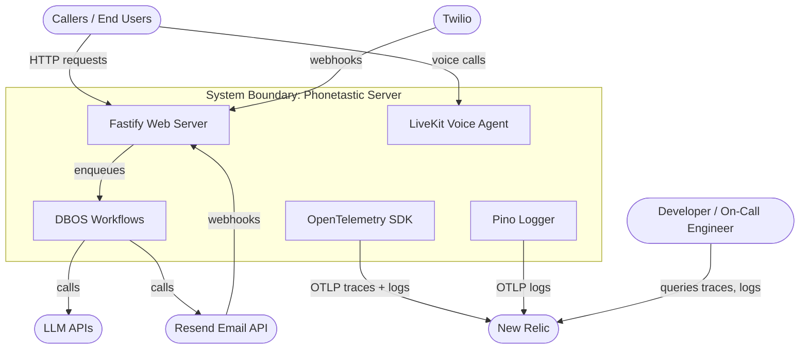

# Use Case Document: Observability (Logging & Tracing)

---

## Reviews

| Reviewer | Status | Feedback |
|---|---|---|
| Jordan | not_started | |

---

## 1. Scope



> Inside the boundary: the two server processes (web, agent), DBOS workflows, and the observability plumbing.
> Outside: New Relic (observability backend), external APIs, and end users.

---

## 2. Actors

| Actor | Type | Description |
|---|---|---|
| Developer | Human | Needs to trace requests, debug failures, and monitor system health |
| On-Call Engineer | Human | Needs to diagnose production incidents quickly using correlated logs and traces |
| Web Server | System | Fastify process serving HTTP API requests |
| Voice Agent | System | LiveKit agent process handling voice calls |
| New Relic | System | Observability backend receiving OTLP traces and logs |

---

## 3. Use Case Index

| ID | Level | Use Case | Primary Actor | Status |
|------|-------|---|---|---|
| G-01 | Goal | Trace any API request end-to-end | -- | Draft |
| G-02 | Goal | Diagnose production failures from logs | -- | Draft |
| F-01 | Flow | Trace an API request through workflows | Developer | Draft |
| F-02 | Flow | Trace a voice call through the agent pipeline | Developer | Deferred |
| F-03 | Flow | Search logs for a specific company or call | On-Call Engineer | Draft |
| F-04 | Flow | Configure observability for a deployment | Developer | Draft |
| O-01 | Op | Initialize OpenTelemetry SDK | -- | Draft |
| O-02 | Op | Create a Pino child logger with context | -- | Draft |
| O-03 | Op | Emit a structured log line | -- | Draft |

---

## 4. Use Cases

### G-01: Trace Any API Request End-to-End

**Business Outcome:**
Every API request produces a distributed trace visible in New Relic, linking the HTTP handler through DBOS workflows, steps, and external API calls into a single trace.

**Flows:**
- F-01: Trace an API request through workflows
- ~~F-02: Trace a voice call through the agent pipeline~~ (deferred — see note below)

> **Note:** Voice call tracing (F-02) is deferred. The LiveKit agents Node.js SDK owns the logging pipeline via its `log()` function. Replacing it with Pino risks breaking SDK-internal logging and cannot be safely validated without end-to-end agent integration tests. Agent instrumentation will be revisited when the LiveKit Node.js SDK exposes `set_tracer_provider` or when we have a test harness for the agent process.

---

### G-02: Diagnose Production Failures from Logs

**Business Outcome:**
Every structured log line carries enough context (trace ID, company ID, call ID, chat ID) for an engineer to filter logs in New Relic and reconstruct the full sequence of events for a specific request, call, or email thread.

**Flows:**
- F-03: Search logs for a specific company or call
- F-04: Configure observability for a deployment

---

### F-01: Trace an API Request Through Workflows

```
Level:          Flow
Primary Actor:  Developer
```

**Jobs to Be Done**

Developer:
  When a customer reports a failed email reply or a broken API call,
  I want to find the trace for that request and see every workflow step it triggered,
  so I can identify which step failed and why.

On-Call Engineer:
  When an alert fires for elevated error rates,
  I want to filter traces by error status and see the full call chain,
  so I can triage the root cause without reading application code.

System:
  Every HTTP request produces a trace. DBOS workflow and step spans are children of the request span. Trace context propagates through all layers.

**Preconditions**
- OpenTelemetry SDK is initialized before the Fastify server starts
- DBOS OTLP export is enabled with valid endpoint configuration
- New Relic OTLP endpoint and API key are configured

**Success Guarantee**
- A trace exists in New Relic for the request, with child spans for each DBOS workflow and step
- The Fastify request log lines contain `trace_id` and `span_id` fields
- External API calls (Resend, Twilio, OpenAI) appear as child spans via HTTP auto-instrumentation

**Main Success Scenario**

| Step | Actor/System | Action |
|------|--------------|--------|
| 1 | End User | Sends an HTTP request to the Fastify server |
| 2 | System | Fastify HTTP instrumentation creates a root span |
| 3 | System | Pino request log includes trace_id and span_id (via instrumentation-pino) |
| 4 | System | Controller enqueues a DBOS workflow |
| 5 | System | DBOS creates child spans for the workflow and each step |
| 6 | System | Steps that call external APIs (Resend, OpenAI) produce child HTTP spans |
| 7 | System | All spans and logs are batched and exported to New Relic via OTLP |
| 8 | Developer | Queries New Relic by trace_id, sees the full span tree |

**Extensions**

```
2a. OTLP exporter cannot reach New Relic:
    1. System buffers spans in the BatchSpanProcessor queue
    2. System logs a warning via Pino: "OTLP export failed"
    3. If queue fills, oldest spans are dropped
    -> Flow continues; request processing is not affected

    Example: New Relic endpoint returns 503 -> spans buffered,
    warning logged, next batch retries automatically

5a. DBOS workflow fails mid-execution:
    1. System records the exception on the workflow span (span.recordException)
    2. System sets span status to ERROR
    3. System logs the error with trace_id attached
    -> Trace is still exported with error status visible in New Relic

    Example: ProcessInboundEmail.sendReply throws after 3 retries ->
    span shows ERROR status, exception message visible in trace detail

*a. OpenTelemetry SDK fails to initialize:
    1. System logs a fatal error to stderr
    2. Server continues to operate without tracing (graceful degradation)
    3. Pino logs are still emitted but without trace_id injection

    Example: Invalid NEW_RELIC_LICENSE_KEY -> SDK init throws,
    server starts, logs lack trace context
```

**Constraints**
- NFR-01: Tracing overhead must not add more than 5ms p99 to request latency
- NFR-02: Observability failures must never block request processing

**Open Questions**
- None

---

### F-02: Trace a Voice Call Through the Agent Pipeline *(Deferred)*

> **Status: Deferred.** The LiveKit agents Node.js SDK (v1.0.50) owns the agent logging pipeline via its `log()` function. Replacing it with Pino cannot be safely validated without end-to-end integration tests for the agent process. This use case will be implemented when the LiveKit Node.js SDK exposes `set_tracer_provider` or when an agent test harness exists.

```
Level:          Flow
Primary Actor:  Developer
```

**Jobs to Be Done**

Developer:
  When a caller reports a bad experience (wrong response, long silence, dropped call),
  I want to see the full trace of that call including STT, LLM, and TTS timings,
  so I can identify which pipeline stage caused the issue.

System:
  Every voice call session produces a trace linking the agent entry, participant join, LLM turns, tool calls, and session close into a single trace visible in New Relic.

**Preconditions**
- OpenTelemetry SDK is initialized in the agent process
- The agent process has valid New Relic OTLP configuration
- LiveKit agents SDK is configured with an OTEL tracer provider (if supported)

**Success Guarantee**
- A trace exists in New Relic for the call, with spans for agent entry, participant join, and session close
- Voice pipeline metrics (EOU, LLM TTFT, TTS TTFB) are logged as structured fields with the trace_id
- Tool call executions appear as child spans

**Main Success Scenario**

| Step | Actor/System | Action |
|------|--------------|--------|
| 1 | Caller | Dials the business number; LiveKit dispatches agent job |
| 2 | System | Agent entry function creates a root span for the call session |
| 3 | System | Agent logs participant join with companyId, callId, roomName |
| 4 | System | Each LLM turn, STT, and TTS operation is logged with pipeline metrics |
| 5 | System | Tool calls (companyInfo, calendar, endCall) produce child spans |
| 6 | System | Session close logs final state (finished/failed) with reason |
| 7 | System | All spans and logs are exported to New Relic |
| 8 | Developer | Queries New Relic by roomName or callId, sees call timeline |

**Extensions**

```
2a. LiveKit agents SDK does not expose an OTEL tracer provider API in Node.js:
    1. System creates manual spans using the OpenTelemetry API directly
    2. Root span is created at agent entry, child spans for key phases
    -> Flow continues with manual instrumentation

    Example: LiveKit Node.js SDK lacks set_tracer_provider ->
    we use tracer.startActiveSpan('agent.entry', ...) manually

4a. Pipeline metrics event fires outside an active span:
    1. System logs metrics as structured Pino fields (no span linkage)
    2. Metrics are still searchable by roomName and callId in New Relic
    -> Metrics captured even without span context

    Example: MetricsCollected fires before participant join span ->
    log line has roomName but no trace_id; still queryable

*a. Agent process crashes mid-call:
    1. In-flight spans are lost (not exported)
    2. LiveKit detects disconnect and triggers ParticipantDisconnected
    3. Recovery: engineer queries logs by roomName up to the crash point

    Example: OOM kill -> no final spans, but earlier spans and logs
    up to the crash are visible in New Relic
```

**Constraints**
- NFR-01: Tracing overhead must not add perceptible latency to voice pipeline (TTFT, TTFB)
- NFR-02: Observability failures must never affect call quality

**Open Questions**
- None

---

### F-03: Search Logs for a Specific Company or Call

```
Level:          Flow
Primary Actor:  On-Call Engineer
```

**Jobs to Be Done**

On-Call Engineer:
  When a customer reports an issue with their account,
  I want to filter all logs by their companyId or callId,
  so I can see every action the system took for that customer.

System:
  Log lines include entity IDs (companyId, callId, chatId, roomName) only when the code path already has them in scope. The system never queries the database solely to populate log context.

**Preconditions**
- Structured logging is deployed with entity ID fields
- Logs are flowing to New Relic via OTLP

**Success Guarantee**
- Engineer finds all log lines for a given companyId, callId, chatId, or roomName
- Log lines include trace_id for cross-referencing with traces
- Log lines include enough context to reconstruct the sequence of events

**Main Success Scenario**

| Step | Actor/System | Action |
|------|--------------|--------|
| 1 | On-Call Engineer | Opens New Relic, filters logs by companyId = 42 |
| 2 | System | Returns all log lines where companyId = 42 |
| 3 | On-Call Engineer | Identifies a failed workflow step from an error log |
| 4 | On-Call Engineer | Clicks the trace_id to open the distributed trace |
| 5 | On-Call Engineer | Sees the full span tree and identifies the root cause |

**Extensions**

```
1a. Engineer does not know the companyId, only the customer's phone number:
    1. Engineer queries the database or API for the companyId
    -> Flow continues from step 1 with the companyId

    Example: Customer says "my number is 555-1234" -> engineer
    queries phone_numbers table -> finds companyId = 42

2a. No logs found for the given filter:
    1. Engineer broadens the time range or checks a different entity ID
    2. If still no logs, the issue predates the observability deployment
    -> Flow ends; engineer uses other debugging methods

    Example: companyId = 42 with last 1 hour -> 0 results ->
    expand to 24 hours -> finds the relevant logs
```

**Constraints**
- NFR-03: Structured log fields must use consistent names across both processes
- BR-01: Log lines must not contain PII (email bodies, phone numbers, auth tokens)

**Open Questions**
- None

---

### F-04: Configure Observability for a Deployment

```
Level:          Flow
Primary Actor:  Developer
```

**Jobs to Be Done**

Developer:
  When deploying to a new environment (staging, production),
  I want to configure the OTLP endpoint and credentials via environment variables,
  so observability works without code changes.

System:
  Observability configuration is driven entirely by environment variables. Missing or invalid configuration disables OTLP export gracefully without preventing the server from starting.

**Preconditions**
- The application is built and ready to deploy
- New Relic account exists with an OTLP-capable license key

**Success Guarantee**
- Setting OTEL environment variables enables traces and logs export
- Omitting OTEL environment variables disables export silently
- Invalid credentials produce a clear warning log at startup

**Main Success Scenario**

| Step | Actor/System | Action |
|------|--------------|--------|
| 1 | Developer | Sets OTEL_EXPORTER_OTLP_ENDPOINT and OTEL_EXPORTER_OTLP_HEADERS in the environment |
| 2 | System | OpenTelemetry SDK reads environment variables at initialization |
| 3 | System | SDK validates the endpoint is reachable |
| 4 | System | Traces and logs begin flowing to New Relic |
| 5 | Developer | Verifies data appears in New Relic |

**Extensions**

```
1a. Developer omits all OTEL environment variables:
    1. System detects no OTLP configuration
    2. System skips OTLP exporter registration
    3. Pino still logs to stdout; no traces are exported
    -> Server starts normally without observability export

    Example: Local development with no .env OTEL vars ->
    logs to console only, no OTLP traffic

2a. OTEL_EXPORTER_OTLP_ENDPOINT is set but OTEL_EXPORTER_OTLP_HEADERS is missing:
    1. System logs a warning: "OTLP endpoint configured but no auth headers set"
    2. System attempts export; New Relic rejects with 401
    3. System logs the rejection and continues
    -> Server starts; export silently fails until headers are added

    Example: Endpoint set to otlp.nr-data.net but no api-key header ->
    401 errors logged, no data in New Relic
```

**Constraints**
- NFR-02: Observability failures must never prevent the server from starting
- BR-02: Credentials (API keys) must be passed via environment variables, never hardcoded

**Open Questions**
- None

---

### O-01: Initialize OpenTelemetry SDK

Receives environment variables for OTLP endpoint, headers, protocol, and service name.

Creates a NodeSDK instance with:
- OTLP trace exporter (HTTP/protobuf) pointed at the configured endpoint
- OTLP log exporter pointed at the configured endpoint
- BatchSpanProcessor for trace batching
- Auto-instrumentations: HTTP, Fastify (web process) or HTTP (agent process)
- Pino instrumentation for trace context injection into log lines

Starts the SDK before any application code loads. Returns void.

Failure cases:
- If no OTLP endpoint is configured, skips exporter registration and returns (no-op mode)
- If SDK initialization throws, logs to stderr and returns (server starts without tracing)

Called by:
- F-01 at step 2 (web server startup)
- F-02 at step 2 (agent startup)

---

### O-02: Create a Pino Child Logger with Context

Receives a parent Pino logger and a context object containing entity IDs (e.g., `{ companyId, callId }`).

Creates a Pino child logger via `parent.child(context)`. All subsequent log calls on the child include the context fields in every log line.

Returns the child logger instance.

Failure cases:
- If context is empty or undefined, returns the parent logger unchanged

Called by:
- F-01 at step 3 (controller creates child logger with request context)
- F-02 at step 3 (agent creates child logger with call context)
- F-03 at step 2 (structured fields enable the log query)

---

### O-03: Emit a Structured Log Line

Receives a Pino logger (or child logger), a log level, a message string, and an optional metadata object.

Writes a JSON log line containing: timestamp, level, message, all inherited child logger fields (companyId, callId, etc.), and trace_id/span_id (injected by @opentelemetry/instrumentation-pino if a span is active).

The log line is written to stdout (for local dev) and simultaneously sent to New Relic via pino-opentelemetry-transport (in production).

Failure cases:
- If no active span exists, trace_id and span_id are omitted from the log line
- If pino-opentelemetry-transport fails to connect, logs still appear on stdout

Called by:
- F-01 at steps 3, 5, 6
- F-02 at steps 3, 4, 5, 6
- F-03 at step 2 (these are the logs being queried)

---

## 5. Appendix A -- Non-Functional Requirements

| ID | Category | Constraint |
|---|---|---|
| NFR-01 | Latency | Tracing instrumentation must add less than 5ms p99 to HTTP request latency and must not add perceptible latency to the voice pipeline |
| NFR-02 | Resilience | Observability failures (export errors, SDK crashes) must never prevent the server from starting or block request/call processing |
| NFR-03 | Consistency | Structured log field names must be identical across both processes (web server and agent) |

---

## 6. Appendix B -- Business Rules

| ID | Rule |
|---|---|
| BR-01 | Log lines must not contain PII: no email bodies, phone numbers in plaintext, auth tokens, or passwords |
| BR-02 | Observability credentials (New Relic API key) must be passed via environment variables, never committed to source |
| BR-03 | Never query the database solely to populate log or span context. Use entity IDs only when already available in the code path (e.g., from request params, workflow args, or session state). |

---

## 7. Appendix C -- Data Dictionary

| Field | Type | Constraints | Notes |
|---|---|---|---|
| trace_id | string | 32 hex chars | Injected by @opentelemetry/instrumentation-pino |
| span_id | string | 16 hex chars | Injected by @opentelemetry/instrumentation-pino |
| trace_flags | string | "01" or "00" | Sampling flag |
| companyId | number | positive integer | Entity context; set on child logger |
| callId | number | positive integer | Entity context for voice calls |
| chatId | number | positive integer | Entity context for email chats |
| emailId | number | positive integer | Entity context for individual emails |
| roomName | string | non-empty | LiveKit room name for voice calls |
| workflowId | string | UUID | DBOS workflow execution ID |

---

## Appendix D -- Changelog

| Date | Author | Change |
|---|---|---|
| 2026-03-20 | Claude | Initial draft |
