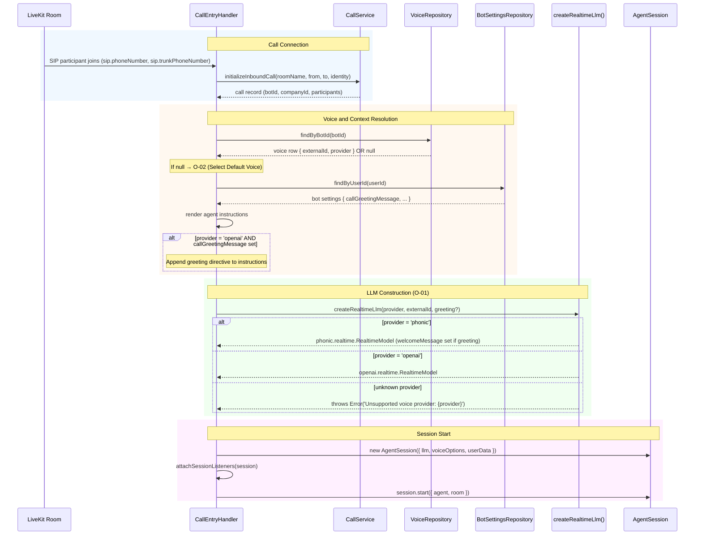
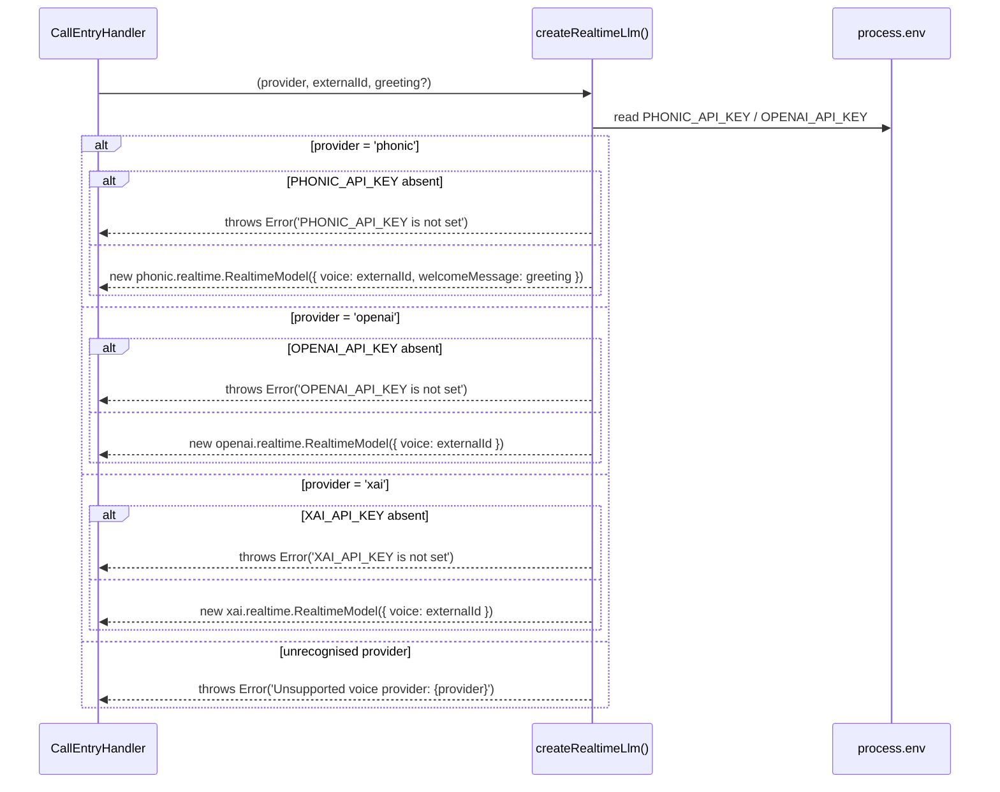
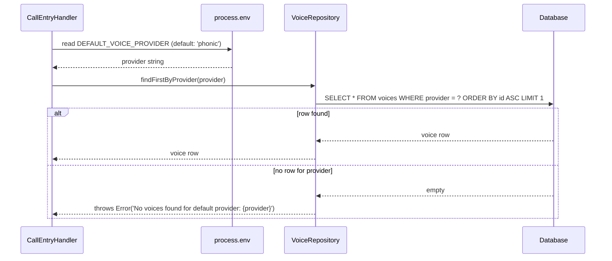
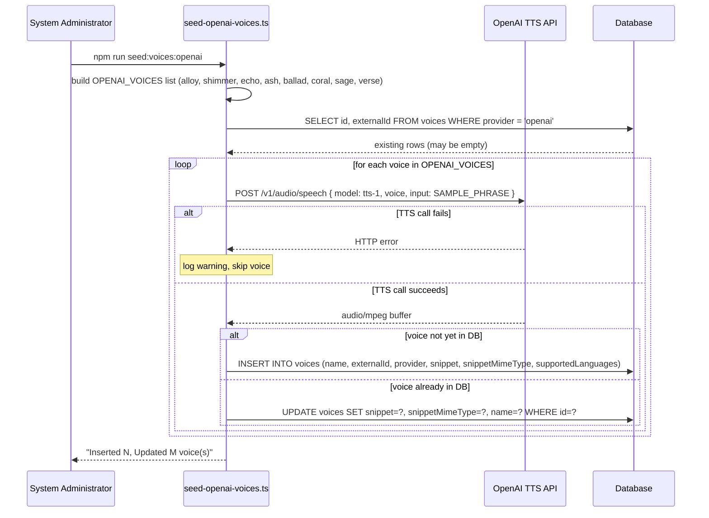

# Technical Design Document: Multi-Provider Realtime Voice Support

Implements: [Use Cases](./openai-realtime-use-cases.md)

---

# Reviews

| Reviewer | Status | Feedback |
|---|---|---|
| Jordan Gaston | not_started | |

---

# Use Case Implementations

## Call Handled with Correct Provider — Implements F-01



## Resolve Realtime LLM — Implements O-01



## Select Default Voice — Implements O-02



## Seed OpenAI Voices — Implements F-03



---

# Tables

## No Schema Migrations Required

The `voices.provider` column (`varchar(255) NOT NULL DEFAULT 'cartesia'`) already exists and holds freeform provider strings. OpenAI voices are seeded as new rows with `provider = 'openai'`. No DDL changes are needed.

## Changes to `voices` (data only)

Eight new rows added by `seed-openai-voices.ts`:

| externalId | name | provider | supportedLanguages | snippet | snippetMimeType |
|---|---|---|---|---|---|
| alloy | Alloy | openai | {en} | (TTS-generated mp3) | audio/mpeg |
| shimmer | Shimmer | openai | {en} | (TTS-generated mp3) | audio/mpeg |
| echo | Echo | openai | {en} | (TTS-generated mp3) | audio/mpeg |
| ash | Ash | openai | {en} | (TTS-generated mp3) | audio/mpeg |
| ballad | Ballad | openai | {en} | (TTS-generated mp3) | audio/mpeg |
| coral | Coral | openai | {en} | (TTS-generated mp3) | audio/mpeg |
| sage | Sage | openai | {en} | (TTS-generated mp3) | audio/mpeg |
| verse | Verse | openai | {en} | (TTS-generated mp3) | audio/mpeg |

Rows are matched for upsert by `(provider, externalId)`.

---

# APIs

No new endpoints. The existing `GET /v1/voices` and `PATCH /v1/bot_settings` endpoints already support this feature without modification: seeded OpenAI voice rows appear in the voice list automatically, and `voice_id` in bot settings already accepts any valid voice row id.

---

# Component Changes

## `src/config/env.ts`

Add two fields to `envSchema`:

```
XAI_API_KEY: z.string().optional()
DEFAULT_VOICE_PROVIDER: z.enum(['phonic', 'openai', 'xai']).default('phonic')
```

## `src/agent/realtime-llm-factory.ts` (new file)

A pure function module. No class, no DI registration.

```
createRealtimeLlm(provider: string, externalId: string, greeting?: string | null): llm.RealtimeModel
```

- If `provider = 'phonic'`: constructs `phonic.realtime.RealtimeModel({ voice: externalId, welcomeMessage: greeting ?? undefined })`
- If `provider = 'openai'`: constructs `openai.realtime.RealtimeModel({ voice: externalId })`
  - Greeting is not passed here; caller is responsible for injecting it into agent instructions
- If `provider = 'xai'`: constructs `xai.realtime.RealtimeModel({ voice: externalId })`
  - Greeting is not passed here; caller is responsible for injecting it into agent instructions
- If `provider` is unrecognised: throws `Error('Unsupported voice provider: {provider}')`
- If the required API key env var is absent: throws with the variable name

## `src/repositories/voice-repository.ts`

Add one method:

```
findFirstByProvider(provider: string, tx?: Transaction): Promise<VoiceRow | undefined>
```

Queries `SELECT * FROM voices WHERE provider = ? ORDER BY id ASC LIMIT 1`.

## `src/agent/call-entry-handler.ts`

### Structural change: defer LLM and AgentSession construction

**Current flow**: `CallEntryHandlerFactory.create()` builds `llm`, `session`, and `HangTightCallback` before any call data exists.

**New flow**: `create()` builds only `backgroundAudio`, `agent` (default tool set), and the non-session callbacks. LLM and `AgentSession` are constructed inside `applyContext()` after the voice row is resolved.

**`CallEntryHandlerFactory.create()` removes**:
- `phonic.realtime.RealtimeModel` construction
- `voice.AgentSession` construction
- `HangTightCallback` construction (moved to `handle()`)

**`CallEntryHandlerFactory.create()` adds**:
- `VoiceRepository` injection (already registered in DI)

**`CallEntryHandler` constructor signature change**:
- Remove `session: voice.AgentSession<SessionData>`
- Remove `llm: phonic.realtime.RealtimeModel`
- Add `voiceRepo: VoiceRepository`
- `session` becomes a private mutable field set in `handle()`

**`CallEntryHandler.handle()` changes**:
```
attachRoomListeners()               ← unchanged, no session dependency
await ctx.connect()
caller = await ctx.waitForParticipant()
{ agent, session } = await initializeCall(caller)  ← now returns session too
this.session = session
attachSessionListeners()            ← moved to after session creation
new HangTightCallback(session)      ← created here, not in factory
session.start({ agent, room })
backgroundAudio.start(...)
```

**`CallEntryHandler.applyContext()` changes**:
- Look up voice: `voiceRepo.findByBotId(botId)` → fallback to `voiceRepo.findFirstByProvider(env.DEFAULT_VOICE_PROVIDER)` if null
- Build instructions via `renderPrompt()`
- If `provider = 'openai'` and greeting is set: append `\n\nBegin by greeting the caller with: "{message}"` to instructions
- Call `createRealtimeLlm(provider, externalId, greeting)` for phonic (passes greeting); for openai passes no greeting
- Construct `new voice.AgentSession({ llm, voiceOptions, userData })`
- Return `{ agent, session }` instead of just `agent`

## `src/db/seed-xai-voices.ts` (new file)

Mirrors the structure of `seed-openai-voices.ts`. Key differences:
- Static `XAI_VOICES` array: `['Ara']` (xAI's documented realtime voice)
- Requires `XAI_API_KEY`; throws if absent
- Snippet is a 1-byte placeholder buffer — xAI has no TTS API for snippet generation
- Upsert keyed on `(provider = 'xai', externalId)`

`package.json` `scripts` addition:
```json
"db:seed-voices:xai": "tsx src/db/seed-xai-voices.ts"
```

## `src/db/seed-openai-voices.ts` (new file)

Mirrors the structure of `seed-voices.ts`. Key differences:
- Static `OPENAI_VOICES` array: `['alloy', 'shimmer', 'echo', 'ash', 'ballad', 'coral', 'sage', 'verse']`
- A constant `SAMPLE_PHRASE` used as TTS input for all voices (e.g. `"Hi, I'm here to help. How can I assist you today?"`)
- Snippets generated by calling `POST https://api.openai.com/v1/audio/speech` with `{ model: 'tts-1', voice: externalId, input: SAMPLE_PHRASE }` — response body is an `audio/mpeg` buffer
- Requires `OPENAI_API_KEY`; throws if absent
- Upsert keyed on `(provider = 'openai', externalId)`

`package.json` `scripts` addition:
```json
"seed:voices:openai": "node --loader ts-node/esm src/db/seed-openai-voices.ts"
```

---

# Testing

## Test Coverage

| Use Case | Type | Unit | Integration | E2E |
|---|---|---|---|---|
| F-01: Handle call using configured voice provider | Flow | — | ✓ | — |
| F-02: Change bot voice to an OpenAI voice | Flow | — | ✓ | — |
| F-03: Seed OpenAI voices | Flow | — | ✓ | — |
| O-01: Resolve realtime LLM | Op | ✓ | — | — |
| O-02: Select default voice | Op | — | ✓ | — |

## Test Approach

### Unit Tests — `createRealtimeLlm`

Test file: `src/agent/realtime-llm-factory.test.ts`

Tests run in isolation; no database, no network.

| Case | Input | Expected |
|---|---|---|
| phonic voice, no greeting | provider='phonic', externalId='sabrina' | Returns phonic.RealtimeModel; `_options.voice = 'sabrina'`; `_options.welcomeMessage` undefined |
| xai voice | provider='xai', externalId='Ara' | Returns xai.RealtimeModel; `_options.voice = 'Ara'` |
| xai, missing XAI_API_KEY | XAI_API_KEY unset | Throws with XAI_API_KEY in message |
| phonic voice, with greeting | provider='phonic', externalId='sabrina', greeting='Hello!' | Returns phonic.RealtimeModel; `_options.welcomeMessage = 'Hello!'` |
| openai voice | provider='openai', externalId='alloy' | Returns openai.RealtimeModel; `_options.voice = 'alloy'` |
| unknown provider | provider='cartesia', externalId='x' | Throws `Error('Unsupported voice provider: cartesia')` |
| phonic, missing PHONIC_API_KEY | PHONIC_API_KEY unset | Throws with PHONIC_API_KEY in message |
| openai, missing OPENAI_API_KEY | OPENAI_API_KEY unset | Throws with OPENAI_API_KEY in message |

Mock: `process.env` values for API key presence/absence. No mocking of the plugin constructors — let them construct.

### Integration Tests — `CallEntryHandler`

Test file: `src/agent/call-entry-handler.test.ts` (existing, extend)

Extend existing test setup to cover:

1. **Phonic voice configured**: bot settings has phonic voice → `applyContext` creates a `phonic.RealtimeModel` session
2. **OpenAI voice configured**: bot settings has openai voice → `applyContext` creates an `openai.RealtimeModel` session
3. **No voice configured, DEFAULT_VOICE_PROVIDER=phonic**: fallback to first phonic voice row
4. **No voice configured, DEFAULT_VOICE_PROVIDER=openai**: fallback to first openai voice row
5. **OpenAI voice with greeting**: greeting directive appears in agent instructions; not passed to LLM
6. **Phonic voice with greeting**: `_options.welcomeMessage` is set on the LLM; instructions unchanged

Mock: real test DB with seeded voice rows; mock `CallService`, `LiveKitService`. Do not mock the plugin constructors — verify by checking the returned model's constructor identity or `model.provider` property.

### Integration Tests — `VoiceRepository.findFirstByProvider`

Extend `src/repositories/voice-repository.test.ts`:
- Seed rows with `provider='phonic'` and `provider='openai'`
- Verify `findFirstByProvider('openai')` returns the expected row
- Verify `findFirstByProvider('unknown')` returns undefined (not throws)

### Integration Tests — `seed-openai-voices.ts`

Test file: `src/db/seed-openai-voices.test.ts`

Setup: real test DB, stubbed OpenAI TTS API (returns a fixed 4-byte mp3 buffer for any request).

1. **Fresh DB**: all 8 voices inserted with `snippetMimeType = 'audio/mpeg'`; counts reported correctly
2. **Re-run (idempotent)**: 0 inserted, 8 updated; no duplicate rows
3. **TTS call fails for one voice**: warning logged for that voice; remaining voices upserted

## Test Infrastructure

**Voice fixture factory** (extend existing test helpers): a function `createVoiceRow({ provider, externalId })` that inserts a voice row with a minimal 1-byte snippet into the test DB. Used by `CallEntryHandler` and `VoiceRepository` integration tests.

**TTS stub**: a lightweight HTTP stub (e.g. using `nock` or `msw`) that intercepts `POST https://api.openai.com/v1/audio/speech` and returns a fixed 4-byte buffer with `content-type: audio/mpeg`. Used by seed script integration tests only — no network calls in CI.

---

# Deployment

## Migrations

| Order | Type | Description | Backwards-Compatible |
|---|---|---|---|
| 1 | data | Run `npm run seed:voices:openai` to add 8 OpenAI voice rows | yes — additive only |

No schema migrations. No column additions. No DDL.

## Deploy Sequence

1. **Deploy web server** (`fly deploy -a phonetastic-web`). No breaking changes to existing behavior.
2. **Seed OpenAI voices**: `fly ssh console -a phonetastic-web -C "node dist/db/seed-openai-voices.js"`. Safe to run before or after agent deploy.
3. **Deploy voice agent** (`lk agent deploy`). New agent reads voice provider from DB and env.

The web server and agent may be at different versions simultaneously during deploy without breakage: old agent code always uses phonic regardless of voice row, new agent code reads provider from voice row.

## Rollback Plan

If the new agent misbehaves:
1. `lk agent rollback` — reverts agent to previous version. It will use phonic for all calls regardless of configured voice.
2. No data rollback needed — the OpenAI voice rows in `voices` are inert to old agent code.
3. No schema rollback needed — no DDL was applied.

---

# Monitoring

## Logging

Add one structured log field to the existing call initialization log at `INFO` level:

```
{ roomName, callId, voiceProvider: 'phonic' | 'openai', voiceExternalId: string }
```

Emitted in `applyContext()` after voice resolution, before LLM construction. Enables post-hoc analysis of provider distribution and debugging of misconfiguration.

No new metrics. Provider selection is configuration — not a reliability signal that warrants alerting.

---

# Decisions

## Defer LLM and AgentSession construction until after voice lookup

**Framework:** Direct criterion

`voice.AgentSession` from `@livekit/agents` does not support swapping its `llm` after construction — the constructor parameter is the only injection point. The current code constructs the session in `CallEntryHandlerFactory.create()`, before the SIP call attributes (and therefore the bot voice) are known. The only correct path is to defer construction until after `applyContext()` resolves the voice row.

**Choice:** Construct LLM and AgentSession in `applyContext()`, just before `session.start()`.

### Alternatives Considered
- **Construct with a default LLM, swap before start**: Not supported by the `AgentSession` API — `llm` is set once at construction.
- **Look up the bot voice at prewarm time using the room name**: The room name is known at `create()`, but the call record (which maps a room to a bot) only exists after `CallService.initializeInboundCall()` runs. That call requires SIP attributes from the SIP participant, which are not available until after `ctx.connect()` and `ctx.waitForParticipant()`.

---

## TTS-generated snippets for OpenAI voice previews

**Framework:** Direct criterion

Static WAV files require manual creation and maintenance — someone must record or source 8 audio clips and commit them to the repository. The OpenAI TTS API (`POST /v1/audio/speech`, model `tts-1`) generates a snippet for any voice on demand in a single HTTP call, using the same `OPENAI_API_KEY` already required by the agent. This eliminates manual asset management, ensures previews are always generated by the actual voice, and means adding new voices in future requires no file changes.

**Choice:** Generate snippets via the OpenAI TTS API at seed time. The seed script calls the TTS API once per voice with a fixed `SAMPLE_PHRASE` and stores the returned `audio/mpeg` buffer as the `snippet`.

### Alternatives Considered
- **Static WAV files**: requires manual recording or sourcing of 8 audio clips; breaks the automation goal stated in the feature request.

---

## OpenAI greeting injected into agent instructions

**Framework:** Direct criterion

`openai.realtime.RealtimeModel` has no `welcomeMessage` constructor option — it is a phonic-specific feature. The two documented mechanisms for controlling model behaviour on session start are (1) agent instructions and (2) `conversation.item.create` events. The `conversation.item.create` path requires manual WebSocket event injection at session start and is not supported through the `@livekit/agents` session abstraction. Injecting into instructions is the only supported path.

**Choice:** Append `\n\nBegin by greeting the caller with: "{message}"` to agent instructions when provider is `openai` and a call greeting is configured.

### Alternatives Considered
- **`conversation.item.create` before session start**: Not exposed through `voice.AgentSession`; would require direct WebSocket manipulation.
- **Ignore greeting for OpenAI**: Poor user experience — greeting messages are explicitly configured by company owners.

---

# Open Questions

| ID | Question | Status | Resolution |
|---|---|---|---|
| Q-01 | Can the OpenAI realtime model's voice be changed after session construction (via `_options.voice` mutation), or must it be set at construction time? | open | Relevant only if we need mid-call voice swapping — not required for this feature. |
| Q-02 | Should OpenAI voice snippets be generated at seed time via the TTS API instead of bundled as static assets? | resolved | TTS API. See Decisions section. |
| Q-03 | Does appending a greeting directive to agent instructions produce reliable greeting behavior in OpenAI realtime, or does the model sometimes omit it? | open | Test manually before shipping to production; fallback is acceptable (caller hears silence until they speak). |

---

# Appendix A — Changelog

| Date | Author | Change |
|---|---|---|
| 2026-04-02 | Jordan Gaston | Initial draft |
| 2026-04-02 | Jordan Gaston | Switch OpenAI voice snippets from static WAV files to TTS API generation at seed time |
