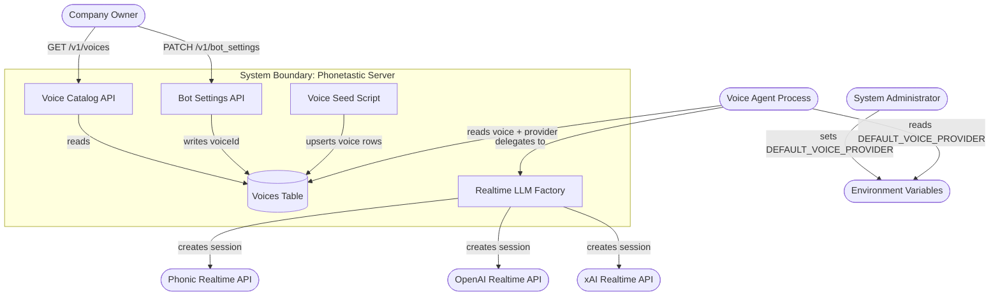

# Use Case Document: OpenAI Realtime Voice Provider Support

---

## Reviews

| Reviewer | Status | Feedback |
|---|---|---|
| Jordan Gaston | not_started | |

---

## 1. Scope



> Anything inside the boundary is in scope.
> Anything outside is a dependency — not owned by this system.

---

## 2. Actors

| Actor | Type | Description |
|---|---|---|
| System Administrator | Human | Deploys the server and sets environment variables including `DEFAULT_VOICE_PROVIDER`. |
| Company Owner | Human | Selects a voice for their bot via the bot settings API. Changing a voice may implicitly change the provider. |
| Voice Agent Process | System | The LiveKit agent process. Reads voice configuration at call time and creates the appropriate realtime LLM session. |

---

## 3. Use Case Index

| ID | Level | Use Case | Primary Actor | Status |
|---|---|---|---|---|
| G-01 | Goal | Support multiple realtime voice providers | — | Draft |
| F-01 | Flow | Handle call using configured voice provider | Voice Agent Process | Not Started |
| F-02 | Flow | Change bot voice to an OpenAI voice | Company Owner | Not Started |
| F-03 | Flow | Seed OpenAI voices into the voice catalog | System Administrator | Not Started |
| O-01 | Op | Resolve realtime LLM for a call | — | Not Started |
| O-02 | Op | Select default voice | — | Not Started |

---

## 4. Use Cases

### G-01: Support Multiple Realtime Voice Providers

**Business Outcome:**
Every call is handled by the correct realtime voice provider — phonic or OpenAI — as determined by the company's configured voice, with a system-wide default applied when no voice is configured.

**Flows:**
- F-01: Handle call using configured voice provider
- F-02: Change bot voice to an OpenAI voice
- F-03: Seed OpenAI voices into the voice catalog

---

### F-01: Handle Call Using Configured Voice Provider

```
Level:          Flow
Primary Actor:  Voice Agent Process
```

**Jobs to Be Done**

Voice Agent Process:
  When a call arrives,
  I want to create a realtime LLM session using the correct provider and voice for this company,
  so the caller hears the voice their business owner selected.

Company Owner:
  When a customer calls my business,
  I want my configured voice to be used — not a system default — on every call,
  so my brand experience is consistent.

System:
  The provider used for a call must always match the `provider` field of the company's configured voice row.

**Preconditions**
- A LiveKit room exists for the inbound call
- The `voices` table contains at least one row with `provider = 'phonic'` and at least one with `provider = 'openai'`
- `DEFAULT_VOICE_PROVIDER` is set to a valid value (`phonic` or `openai`)
- Either `PHONIC_API_KEY` or `OPENAI_API_KEY` is set, consistent with the configured provider

**Success Guarantee**
- A realtime LLM session is started using the provider that matches the company's configured voice
- The session's voice is set to the `externalId` of the configured voice row
- If a call greeting message is configured, it is applied to the session
- The call proceeds normally

**Main Success Scenario**

| Step | Actor/System | Action |
|------|--------------|--------|
| 1 | Voice Agent Process | Receives inbound call and connects to the LiveKit room |
| 2 | System | Waits for the SIP participant to join and reads the bot ID from the call record |
| 3 | System | Looks up the bot's configured voice via `bot_settings.voiceId` → `voices` row |
| 4 | System | Invokes O-01 (Resolve Realtime LLM) with the voice row, producing a `RealtimeModel` instance |
| 5 | System | Creates an `AgentSession` with the resolved `RealtimeModel` |
| 6 | System | Applies the call greeting message to the session if one is configured |
| 7 | System | Starts the session and connects the agent |

**Extensions**

```
3a. No bot settings row exists for the bot:
    1. System invokes O-02 (Select Default Voice) to obtain a default voice row
    → Flow continues from step 4 with the default voice

    Example: New company with no voice selected → system reads DEFAULT_VOICE_PROVIDER=openai,
    returns the openai voice row with externalId='alloy'

3b. The voice row referenced by bot_settings.voiceId no longer exists:
    1. System invokes O-02 (Select Default Voice)
    → Flow continues from step 4 with the default voice

    Example: Voice was deleted from catalog → system falls back to default provider voice

4a. O-01 fails because the required API key is missing:
    1. System logs error with provider name and call room name
    → Flow ends in failure; LiveKit retries or discards the job

    Example: OPENAI_API_KEY not set, company has openai voice → error logged, call not answered

6a. Call greeting message is configured and provider is phonic:
    1. System sets _options.welcomeMessage on the RealtimeModel instance
    → Flow continues from step 7

    Example: callGreetingMessage = "Thanks for calling Acme!" → phonic model says it on connect

6b. Call greeting message is configured and provider is openai:
    1. System appends "Begin by greeting the caller with: {message}" to the agent instructions
    → Flow continues from step 7

    Example: callGreetingMessage = "Welcome to Acme!" → instructions include the greeting directive

*a. Voice Agent Process loses connection to LiveKit mid-session:
    1. Session close event fires; existing close callback handles cleanup
    → Flow ends in partial failure; transcript is logged up to the disconnect point
```

**Constraints**
- NFR-01: Provider resolution must complete before `session.start()` is called
- BR-01: The `provider` field of the resolved voice row determines which plugin class is instantiated
- BR-02: A phonic voice must never be passed to an OpenAI RealtimeModel, and vice versa

**Open Questions**
- [ ] Can the OpenAI realtime model's voice be set after session construction, or must it be set at construction time?

---

### F-02: Change Bot Voice to an OpenAI Voice

```
Level:          Flow
Primary Actor:  Company Owner
```

**Jobs to Be Done**

Company Owner:
  When I want a different voice for my phone bot,
  I want to select from available voices including OpenAI options,
  so I can choose a voice that fits my brand without being limited to one provider.

System:
  A voice change must be persisted before the next call begins; in-flight calls are unaffected.

**Preconditions**
- Company owner is authenticated
- The `voices` table contains at least one row with `provider = 'openai'`
- The owner has an existing `bot_settings` row

**Success Guarantee**
- `bot_settings.voiceId` is updated to reference the selected OpenAI voice row
- The next inbound call uses the OpenAI realtime provider
- In-flight calls are not disrupted

**Main Success Scenario**

| Step | Actor/System | Action |
|------|--------------|--------|
| 1 | Company Owner | Calls `GET /v1/voices` to browse available voices |
| 2 | System | Returns a paginated list of voice summaries including OpenAI voices |
| 3 | Company Owner | Selects a voice with `provider = 'openai'` and notes its `id` |
| 4 | Company Owner | Calls `PATCH /v1/bot_settings` with `{ bot_settings: { voice_id: <id> } }` |
| 5 | System | Validates the voice_id exists in the voices table |
| 6 | System | Updates `bot_settings.voiceId` to the selected voice id |
| 7 | System | Returns the updated bot settings |

**Extensions**

```
5a. The submitted voice_id does not exist in the voices table:
    1. System returns HTTP 404 with error message "Voice not found"
    → Flow ends in failure; bot_settings unchanged

    Example: voice_id = 9999 (non-existent) → 404 response

5b. The submitted voice_id exists but belongs to a different user's isolated voice pool:
    1. Not applicable — voices are a shared catalog; all authenticated users may select any voice
    → No change needed

*a. Request arrives while a call is in progress for this owner:
    1. The in-progress call is unaffected; it already has its LLM session
    2. The update is persisted for the next call
    → Flow continues from step 6

    Example: Owner changes voice during a live call → current call unaffected, next call uses new voice
```

**Constraints**
- BR-03: Voice selection takes effect on the next call only; session mid-call mutation is not supported

**Open Questions**
- None

---

### F-03: Seed OpenAI Voices into the Voice Catalog

```
Level:          Flow
Primary Actor:  System Administrator
```

**Jobs to Be Done**

System Administrator:
  When deploying or updating the server,
  I want OpenAI voices to be available in the voice catalog,
  so company owners can select them and calls can route to the OpenAI provider.

System:
  Seeding must be idempotent — re-running must not create duplicate rows.

**Preconditions**
- Database is accessible
- `OPENAI_API_KEY` is set (for generating voice snippets, or static assets are available)

**Success Guarantee**
- One row exists in `voices` for each OpenAI voice (`alloy`, `shimmer`, `echo`, `ash`, `ballad`, `coral`, `sage`, `verse`)
- Each row has `provider = 'openai'`, `externalId` equal to the voice name, and a non-null `snippet`
- Existing rows are updated (name, snippet) if they already exist; no duplicates are created

**Main Success Scenario**

| Step | Actor/System | Action |
|------|--------------|--------|
| 1 | System Administrator | Runs `npm run seed:voices:openai` |
| 2 | System | Reads the static list of OpenAI voice names |
| 3 | System | For each voice, loads its audio snippet from bundled static assets in `src/config/voices/openai/` |
| 4 | System | Queries existing `voices` rows with `provider = 'openai'` |
| 5 | System | Inserts new rows for voices not yet present; updates existing rows |
| 6 | System | Logs count of inserted and updated rows |

**Extensions**

```
3a. A static snippet file is missing for one or more voices:
    1. System logs a warning identifying the missing voice name
    2. System skips that voice and continues with the remaining voices
    → Flow completes with a warning; missing voices are not seeded

    Example: openai/ash-preview.wav missing → warning logged, ash row not inserted

5a. Database insert fails due to a constraint violation:
    1. System logs the error and halts
    → Flow ends in failure; partial inserts may have occurred

    Example: voices.name unique constraint violated → error logged, seed script exits non-zero
```

**Constraints**
- BR-04: Seed script must be idempotent; re-running must not create duplicate voice rows
- NFR-02: Seed script must complete within 60 seconds on a standard CI runner

**Open Questions**
- [ ] Should OpenAI voice snippets be generated via a TTS call at seed time, or are static WAV files sufficient?

---

## 5. Operations

### O-01: Resolve Realtime LLM

Receives a `voice` row (`{ externalId: string, provider: string }`).

Reads the `provider` field and dispatches to the matching plugin:
- `'phonic'` → `phonic.realtime.RealtimeModel({ voice: externalId, welcomeMessage: greeting })`
- `'openai'` → `openai.realtime.RealtimeModel({ voice: externalId })`
- `'xai'` → `xai.realtime.RealtimeModel({ voice: externalId })`

All models implement `llm.RealtimeModel` from `@livekit/agents`.

Returns a configured `llm.RealtimeModel` instance.

Failure cases:
- If `provider` is not `'phonic'`, `'openai'`, or `'xai'`, throws `Error('Unsupported voice provider: {provider}')`
- If the required API key for the provider is absent from the environment, throws `Error('{PROVIDER}_API_KEY is not set')`

Called by:
- F-01 at step 4

---

### O-02: Select Default Voice

Reads `DEFAULT_VOICE_PROVIDER` from the environment (defaults to `'phonic'` if unset).

Queries the `voices` table for the first row matching the default provider, ordered by `id` ascending.

Returns the voice row.

Failure cases:
- If no voice row exists for the default provider, throws `Error('No voices found for default provider: {provider}')`

Called by:
- F-01 at step 3a
- F-01 at step 3b

---

## Appendix A — Non-Functional Requirements

| ID | Category | Constraint |
|---|---|---|
| NFR-01 | Latency | Provider resolution and LLM construction must complete before `session.start()` is called, adding no observable delay to the caller experience. |
| NFR-02 | Reliability | Seed script must complete within 60 seconds on a standard CI runner. |

---

## Appendix B — Business Rules

| ID | Rule |
|---|---|
| BR-01 | The `provider` field of the resolved voice row determines which plugin class (`phonic.realtime.RealtimeModel`, `openai.realtime.RealtimeModel`, or `xai.realtime.RealtimeModel`) is instantiated. |
| BR-02 | A voice's `externalId` must only be passed to the plugin matching its `provider`. Mismatched provider/externalId is a configuration error. |
| BR-03 | A voice change takes effect on the next call. Sessions already in progress are not mutated. |
| BR-04 | The voice seed script must be idempotent: running it multiple times must not create duplicate rows. Rows are matched by `(provider, externalId)`. |

---

## Appendix C — Data Dictionary

| Field | Type | Constraints | Notes |
|---|---|---|---|
| `voices.provider` | varchar(255) | not null, one of: `'phonic'`, `'openai'`, `'xai'` | Determines which LiveKit agents plugin handles the session. |
| `voices.externalId` | varchar(255) | not null | The voice identifier passed to the plugin. For OpenAI: one of `alloy`, `shimmer`, `echo`, `ash`, `ballad`, `coral`, `sage`, `verse`. For Phonic: the voice ID from their catalog. |
| `DEFAULT_VOICE_PROVIDER` | env string | one of: `'phonic'`, `'openai'`, `'xai'`, default: `'phonic'` | Controls which provider is used when a company has no voice configured. |

---

## Appendix D — Changelog

| Date | Author | Change |
|---|---|---|
| 2026-04-02 | Jordan Gaston | Initial draft |
