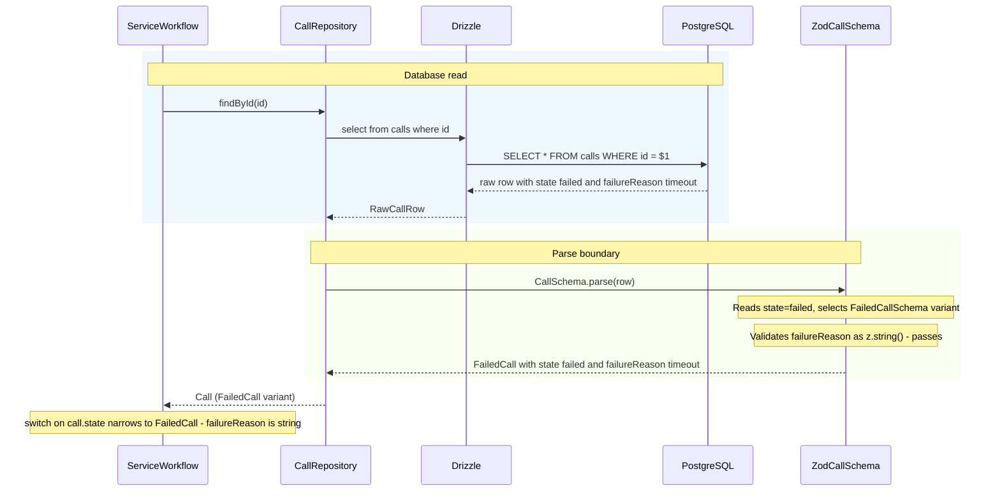
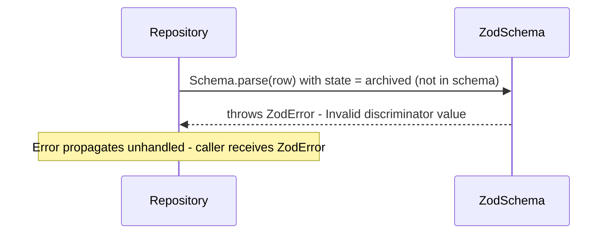
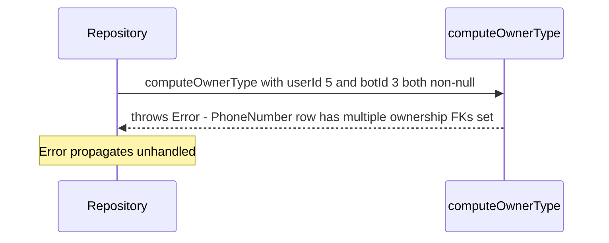
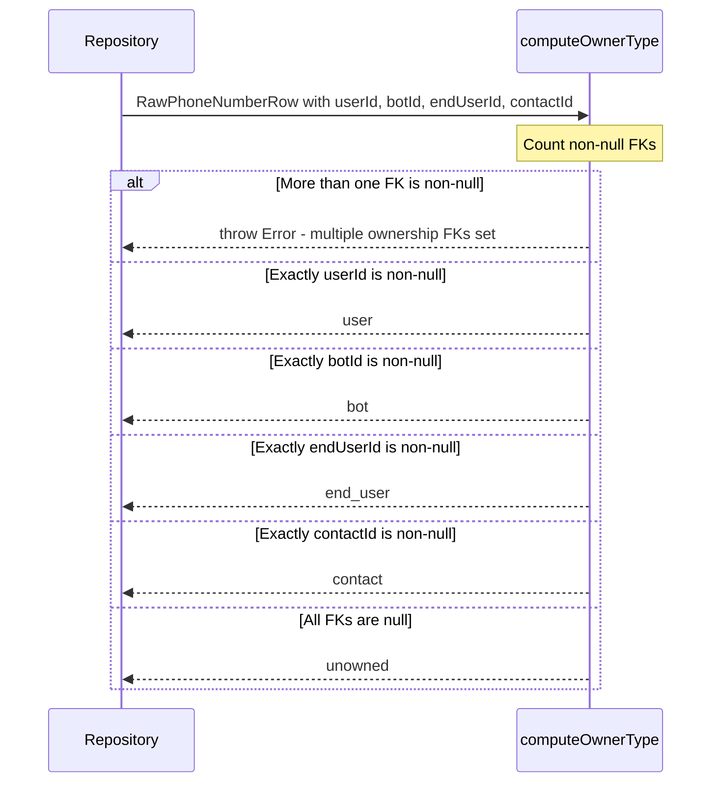
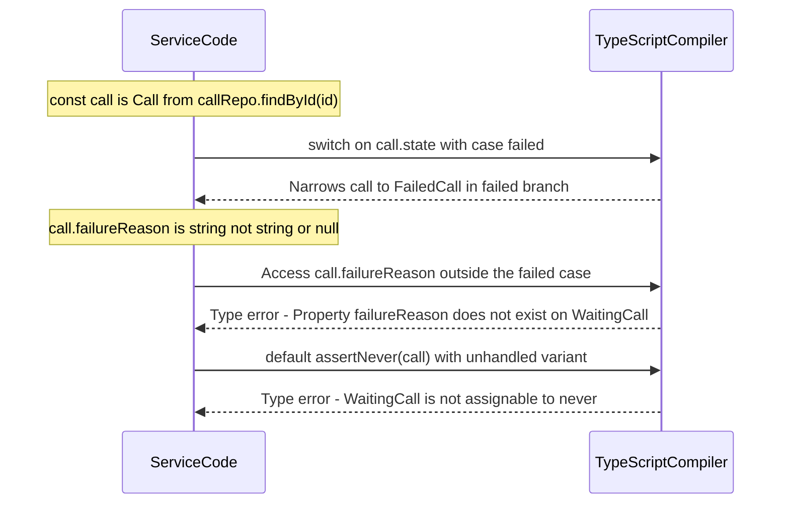

# Technical Design: Zod Discriminated Union Domain Types

---

# Reviews

| Reviewer | Status | Feedback |
|---|---|---|
| Jordan Gaston | in_progress | |

---

# Use Case Implementations

## Read Entity with Natural Discriminant — Implements F-01



Extension — unrecognised discriminant value:


---

## Read Entity with Computed Discriminant — Implements F-02

```mermaid
sequenceDiagram
    participant S as ServiceWorkflow
    participant R as PhoneNumberRepository
    participant C as computeOwnerType
    participant D as Drizzle
    participant DB as PostgreSQL
    participant Z as ZodPhoneNumberSchema

    rect rgb(240, 248, 255)
    note over S,DB: Database read
    S->>R: findById(id)
    R->>D: select from phoneNumbers where id
    D->>DB: SELECT * FROM phone_numbers WHERE id = $1
    DB-->>D: raw row with userId 5 and all other FK columns null
    D-->>R: RawPhoneNumberRow
    end

    rect rgb(255, 248, 240)
    note over R,C: Discriminant injection
    R->>C: computeOwnerType(row)
    note over C: userId is non-null, all others null, returns user
    C-->>R: ownerType = user
    end

    rect rgb(248, 255, 240)
    note over R,Z: Parse boundary
    R->>Z: PhoneNumberSchema.parse with row extended by ownerType user
    note over Z: Reads ownerType=user, selects UserPhoneNumberSchema
    note over Z: Validates userId as z.number() - passes; botId as z.null() - passes
    Z-->>R: UserPhoneNumber with ownerType user and userId 5
    end

    R-->>S: PhoneNumber (UserPhoneNumber variant)
    note over S: switch on phoneNumber.ownerType narrows to UserPhoneNumber
```

Extension — multiple ownership FKs set:


---

## Compute Ownership Discriminant — Implements O-01



---

## Narrow Discriminated Type in Application Code — Implements F-03

This use case has no network or database interaction. It is a compile-time behavior. The sequence below illustrates the TypeScript narrowing behavior at the language level.



---

# Tables

No database schema changes are required. All changes are confined to the TypeScript type layer. The existing Drizzle schema files in `src/db/schema/` are unchanged.

---

# Directory Structure

```
src/
  types/
    index.ts                     ← re-exports all schemas and inferred types
    call.ts
    call-participant.ts
    call-transcript-entry.ts
    sms-message.ts
    attachment.ts
    subdomain.ts
    phone-number.ts
    email.ts
    chat.ts
    __tests__/
      call.test.ts
      call-participant.test.ts
      call-transcript-entry.test.ts
      sms-message.test.ts
      attachment.test.ts
      subdomain.test.ts
      phone-number.test.ts
      email.test.ts
      chat.test.ts
  lib/
    assert-never.ts              ← exhaustiveness helper
  db/
    models.ts                    ← becomes a thin re-export shim
```

---

# Schema Design

## Pattern A — Natural Discriminant (discriminant column exists in DB)

Used by: `Call`, `CallParticipant`, `SmsMessage`, `Attachment`, `Subdomain`, `Chat`

```typescript
// Pattern: define a base schema, extend per variant, compose with z.discriminatedUnion

const CallBaseSchema = z.object({
  id: z.number(),
  externalCallId: z.string(),
  companyId: z.number(),
  fromPhoneNumberId: z.number(),
  toPhoneNumberId: z.number(),
  direction: z.enum(['inbound', 'outbound']),
  testMode: z.boolean(),
  createdAt: z.date(),
});

const WaitingCallSchema    = CallBaseSchema.extend({ state: z.literal('waiting'),    failureReason: z.null() });
const ConnectingCallSchema = CallBaseSchema.extend({ state: z.literal('connecting'), failureReason: z.null() });
const ConnectedCallSchema  = CallBaseSchema.extend({ state: z.literal('connected'),  failureReason: z.null() });
const FinishedCallSchema   = CallBaseSchema.extend({ state: z.literal('finished'),   failureReason: z.null() });
const FailedCallSchema     = CallBaseSchema.extend({ state: z.literal('failed'),     failureReason: z.string() });

export const CallSchema = z.discriminatedUnion('state', [
  WaitingCallSchema, ConnectingCallSchema, ConnectedCallSchema,
  FinishedCallSchema, FailedCallSchema,
]);

export type Call         = z.infer<typeof CallSchema>;
export type WaitingCall  = z.infer<typeof WaitingCallSchema>;
export type FailedCall   = z.infer<typeof FailedCallSchema>;
// ... (one export per variant used in application code)
```

## Pattern B — Computed Discriminant (discriminant derived from nullable FKs)

Used by: `PhoneNumber`, `Email`, `CallTranscriptEntry`

The repository injects a computed field before calling `Schema.parse()`. The Zod schema treats this field as a real discriminant. The computed field is part of the parsed type and is visible to callers.

```typescript
// Pattern: compute discriminant in repository, parse with injected field

// src/types/phone-number.ts
const PhoneNumberBaseSchema = z.object({
  id: z.number(),
  phoneNumberE164: z.string(),
  companyId: z.number().nullable(),
  isVerified: z.boolean().nullable(),
  label: z.string().nullable(),
});

export const UserPhoneNumberSchema = PhoneNumberBaseSchema.extend({
  ownerType: z.literal('user'),
  userId: z.number(),
  endUserId: z.null(),
  botId: z.null(),
  contactId: z.null(),
});

export const BotPhoneNumberSchema = PhoneNumberBaseSchema.extend({
  ownerType: z.literal('bot'),
  userId: z.null(),
  endUserId: z.null(),
  botId: z.number(),
  contactId: z.null(),
});

export const EndUserPhoneNumberSchema = PhoneNumberBaseSchema.extend({
  ownerType: z.literal('end_user'),
  userId: z.null(),
  endUserId: z.number(),
  botId: z.null(),
  contactId: z.null(),
});

export const ContactPhoneNumberSchema = PhoneNumberBaseSchema.extend({
  ownerType: z.literal('contact'),
  userId: z.null(),
  endUserId: z.null(),
  botId: z.null(),
  contactId: z.number(),
});

export const UnownedPhoneNumberSchema = PhoneNumberBaseSchema.extend({
  ownerType: z.literal('unowned'),
  userId: z.null(),
  endUserId: z.null(),
  botId: z.null(),
  contactId: z.null(),
});

export const PhoneNumberSchema = z.discriminatedUnion('ownerType', [
  UserPhoneNumberSchema, BotPhoneNumberSchema,
  EndUserPhoneNumberSchema, ContactPhoneNumberSchema,
  UnownedPhoneNumberSchema,
]);

export type PhoneNumber        = z.infer<typeof PhoneNumberSchema>;
export type UserPhoneNumber    = z.infer<typeof UserPhoneNumberSchema>;
export type BotPhoneNumber     = z.infer<typeof BotPhoneNumberSchema>;
export type EndUserPhoneNumber = z.infer<typeof EndUserPhoneNumberSchema>;
export type ContactPhoneNumber = z.infer<typeof ContactPhoneNumberSchema>;
export type UnownedPhoneNumber = z.infer<typeof UnownedPhoneNumberSchema>;
```

```typescript
// Repository: inject discriminant before parsing

// src/repositories/phone-number-repository.ts
function computeOwnerType(row: typeof phoneNumbers.$inferSelect): PhoneNumberOwnerType {
  const set = (['userId', 'botId', 'endUserId', 'contactId'] as const)
    .filter((k) => row[k] != null);
  if (set.length > 1) {
    throw new Error(`PhoneNumber row ${row.id} has multiple ownership FKs set: ${set.join(', ')}`);
  }
  if (row.userId != null) return 'user';
  if (row.botId != null) return 'bot';
  if (row.endUserId != null) return 'end_user';
  if (row.contactId != null) return 'contact';
  return 'unowned';
}

function parsePhoneNumber(row: typeof phoneNumbers.$inferSelect): PhoneNumber {
  return PhoneNumberSchema.parse({ ...row, ownerType: computeOwnerType(row) });
}
```

---

## Full Entity Schema Reference

### `src/types/call.ts` — Natural discriminant: `state`

| Variant | Discriminant Value | Invariants vs other variants |
|---|---|---|
| `WaitingCall` | `state: 'waiting'` | `failureReason: null` |
| `ConnectingCall` | `state: 'connecting'` | `failureReason: null` |
| `ConnectedCall` | `state: 'connected'` | `failureReason: null` |
| `FinishedCall` | `state: 'finished'` | `failureReason: null` |
| `FailedCall` | `state: 'failed'` | `failureReason: string` (required) |

---

### `src/types/call-participant.ts` — Natural discriminant: `type`

| Variant | Discriminant Value | Invariants vs other variants |
|---|---|---|
| `AgentCallParticipant` | `type: 'agent'` | `agentId: number`; `botId: null`, `endUserId: null`, `voiceId: null` |
| `BotCallParticipant` | `type: 'bot'` | `botId: number`; `agentId: null`, `endUserId: null`; `voiceId: number \| null` |
| `EndUserCallParticipant` | `type: 'end_user'` | `endUserId: number`; `agentId: null`, `botId: null`, `voiceId: null` |

Note: `userId` on the `call_participants` table is a legacy column that duplicates `agentId`. The Zod schemas map `userId` to `agentId` on `AgentCallParticipant` using a `.transform()` applied before the discriminated union composition. See Decision D-01.

---

### `src/types/sms-message.ts` — Natural discriminant: `state`

| Variant | Discriminant Value | Invariants vs other variants |
|---|---|---|
| `PendingSmsMessage` | `state: 'pending'` | `externalMessageSid: null` |
| `SentSmsMessage` | `state: 'sent'` | `externalMessageSid: string` |
| `DeliveredSmsMessage` | `state: 'delivered'` | `externalMessageSid: string` |
| `FailedSmsMessage` | `state: 'failed'` | `externalMessageSid: string \| null` |
| `ReceivedSmsMessage` | `state: 'received'` | `externalMessageSid: string \| null` |

---

### `src/types/attachment.ts` — Natural discriminant: `status`

| Variant | Discriminant Value | Invariants vs other variants |
|---|---|---|
| `PendingAttachment` | `status: 'pending'` | `storageKey: null`, `summary: null` |
| `StoredAttachment` | `status: 'stored'` | `storageKey: string`, `summary: string \| null` |
| `FailedAttachment` | `status: 'failed'` | `storageKey: null`, `summary: null` |

---

### `src/types/subdomain.ts` — Natural discriminant: `status`

| Variant | Discriminant Value | Invariants vs other variants |
|---|---|---|
| `NotStartedSubdomain` | `status: 'not_started'` | `resendDomainId: null` |
| `PendingSubdomain` | `status: 'pending'` | `resendDomainId: string` |
| `VerifiedSubdomain` | `status: 'verified'` | `resendDomainId: string` |
| `PartiallyVerifiedSubdomain` | `status: 'partially_verified'` | `resendDomainId: string` |
| `PartiallyFailedSubdomain` | `status: 'partially_failed'` | `resendDomainId: string \| null` |
| `FailedSubdomain` | `status: 'failed'` | `resendDomainId: string \| null` |
| `TemporaryFailureSubdomain` | `status: 'temporary_failure'` | `resendDomainId: string \| null` |

---

### `src/types/phone-number.ts` — Computed discriminant: `ownerType`

See Pattern B above for the full schema.

| Variant | Discriminant Value | Invariants vs other variants |
|---|---|---|
| `UserPhoneNumber` | `ownerType: 'user'` | `userId: number`; all other FKs `null` |
| `BotPhoneNumber` | `ownerType: 'bot'` | `botId: number`; all other FKs `null` |
| `EndUserPhoneNumber` | `ownerType: 'end_user'` | `endUserId: number`; all other FKs `null` |
| `ContactPhoneNumber` | `ownerType: 'contact'` | `contactId: number`; all other FKs `null` |
| `UnownedPhoneNumber` | `ownerType: 'unowned'` | all FK columns `null` |

---

### `src/types/email.ts` — Computed discriminant: `senderType`

The `direction` column ('inbound'|'outbound') is preserved as a field on all variants. `senderType` is the computed discriminant injected by the repository.

| Variant | Discriminant Value | Invariants vs other variants |
|---|---|---|
| `EndUserEmail` | `senderType: 'end_user'` | `endUserId: number`; `botId: null`, `userId: null` |
| `BotEmail` | `senderType: 'bot'` | `botId: number`; `endUserId: null`, `userId: null` |
| `UserEmail` | `senderType: 'user'` | `userId: number`; `endUserId: null`, `botId: null` |

---

### `src/types/call-transcript-entry.ts` — Computed discriminant: `speakerType`

| Variant | Discriminant Value | Invariants vs other variants |
|---|---|---|
| `EndUserTranscriptEntry` | `speakerType: 'end_user'` | `endUserId: number`; `botId: null`, `userId: null` |
| `BotTranscriptEntry` | `speakerType: 'bot'` | `botId: number`; `endUserId: null`, `userId: null` |
| `UserTranscriptEntry` | `speakerType: 'user'` | `userId: number`; `endUserId: null`, `botId: null` |

---

### `src/types/chat.ts` — Natural discriminant: `channel`

Currently only one variant exists. The discriminated union is defined now so future channels (e.g. `'sms'`, `'voice'`) require only adding a new variant.

| Variant | Discriminant Value | Invariants vs other variants |
|---|---|---|
| `EmailChat` | `channel: 'email'` | `emailAddressId: number \| null` |

---

### Flat schemas (no meaningful state variants)

The following entities have no illegal states to eliminate. They use `z.object()` directly without a discriminated union. Repositories call `Schema.parse(row)` for runtime validation but callers receive a single type, not a union.

| Entity | File | Rationale |
|---|---|---|
| `Company` | `src/types/company.ts` | No nullable FK ambiguity; no status FSM |
| `Address` | `src/types/address.ts` | Simple flat record |
| `OperationHours` | `src/types/operation-hours.ts` | Simple flat record |
| `FAQ` | `src/types/faq.ts` | Simple flat record |
| `Offering` | `src/types/offering.ts` | Simple flat record |
| `User` | `src/types/user.ts` | No cross-FK ambiguity; JSONB settings are typed inline |
| `EndUser` | `src/types/end-user.ts` | Simple flat record |
| `Contact` | `src/types/contact.ts` | Simple flat record |
| `Bot` | `src/types/bot.ts` | JSONB settings typed as nested `z.object()` with `.optional()` fields |
| `Voice` | `src/types/voice.ts` | Simple flat record |
| `Skill` | `src/types/skill.ts` | Simple flat record |
| `Calendar` | `src/types/calendar.ts` | Single provider variant; no ambiguity |
| `CallTranscript` | `src/types/call-transcript.ts` | Simple aggregate |
| `BotToolCall` | `src/types/bot-tool-call.ts` | Simple flat record |
| `EmailAddress` | `src/types/email-address.ts` | Simple flat record |

---

## Composite Types

The existing composite types at the bottom of `models.ts` — `EndUserParticipant`, `BotParticipant`, `AgentParticipant`, `InboundCall` — migrate to `src/types/inbound-call.ts` as Zod-derived composite types built from the constituent schemas.

```typescript
// src/types/inbound-call.ts
import { z } from 'zod';
import { CallBaseSchema } from './call.js';
import { EndUserCallParticipantSchema, BotCallParticipantSchema, AgentCallParticipantSchema } from './call-participant.js';
import { PhoneNumberSchema } from './phone-number.js';
import { CompanySchema } from './company.js';
import { EndUserSchema } from './end-user.js';
import { UserSchema } from './user.js';
import { BotSchema } from './bot.js';
import { VoiceSchema } from './voice.js';

export const InboundCallSchema = CallBaseSchema.extend({
  direction: z.literal('inbound'),
  botParticipant: BotCallParticipantSchema.extend({ bot: BotSchema, voice: VoiceSchema.nullable() }),
  endUserParticipant: EndUserCallParticipantSchema.extend({ endUser: EndUserSchema }).nullable(),
  agentParticipant: AgentCallParticipantSchema.extend({ agent: UserSchema }).nullable(),
  fromPhoneNumber: PhoneNumberSchema,
  toPhoneNumber: PhoneNumberSchema,
  company: CompanySchema,
});

export type InboundCall = z.infer<typeof InboundCallSchema>;
```

---

## Repository Update Pattern

Every `findById`, `findByExternalId`, and `findAll*` method in every repository is updated to call the appropriate schema parse function on returned rows.

For natural discriminants, the change is minimal:

```typescript
// Before
async findById(id: number, tx?: Transaction): Promise<Call | undefined> {
  const [row] = await (tx ?? this.db).select().from(calls).where(eq(calls.id, id));
  return row;
}

// After
async findById(id: number, tx?: Transaction): Promise<Call | undefined> {
  const [row] = await (tx ?? this.db).select().from(calls).where(eq(calls.id, id));
  return row ? CallSchema.parse(row) : undefined;
}
```

For computed discriminants, a private helper is added:

```typescript
// In PhoneNumberRepository
private parse(row: typeof phoneNumbers.$inferSelect): PhoneNumber {
  return PhoneNumberSchema.parse({ ...row, ownerType: computeOwnerType(row) });
}

async findById(id: number, tx?: Transaction): Promise<PhoneNumber | undefined> {
  const [row] = await (tx ?? this.db).select().from(phoneNumbers).where(eq(phoneNumbers.id, id));
  return row ? this.parse(row) : undefined;
}
```

The `create()` and `update*()` methods do **not** change. They accept Drizzle `$inferInsert` shapes and return the domain type (by passing the returned row through `Schema.parse()`).

---

## `src/db/models.ts` Update

`models.ts` becomes a re-export shim. All `$inferSelect` / `$inferInsert` direct type aliases are removed and replaced with imports from `src/types/`:

```typescript
// src/db/models.ts — after
export type {
  Call, WaitingCall, ConnectingCall, ConnectedCall, FinishedCall, FailedCall,
  CallParticipant, AgentCallParticipant, BotCallParticipant, EndUserCallParticipant,
  SmsMessage, PendingSmsMessage, SentSmsMessage, DeliveredSmsMessage, FailedSmsMessage, ReceivedSmsMessage,
  Attachment, PendingAttachment, StoredAttachment, FailedAttachment,
  Subdomain,
  PhoneNumber, UserPhoneNumber, BotPhoneNumber, EndUserPhoneNumber, ContactPhoneNumber, UnownedPhoneNumber,
  Email, EndUserEmail, BotEmail, UserEmail,
  CallTranscriptEntry, EndUserTranscriptEntry, BotTranscriptEntry, UserTranscriptEntry,
  Chat, EmailChat,
  Company, Address, OperationHours, FAQ, Offering, User, EndUser,
  Contact, Bot, Voice, Skill, Calendar, CallTranscript, BotToolCall, EmailAddress,
  InboundCall,
} from '../types/index.js';

// NewXxx insert types remain as Drizzle $inferInsert aliases — unchanged
export type NewCall = typeof calls.$inferInsert;
// ... etc
```

---

## `src/lib/assert-never.ts`

```typescript
/**
 * Exhaustiveness helper for discriminated union switches.
 * TypeScript emits a compile error if any variant of the union is not handled.
 *
 * @param x - The unhandled value; must be `never` at compile time.
 */
export function assertNever(x: never): never {
  throw new Error(`Unhandled discriminated union variant: ${JSON.stringify(x)}`);
}
```

---

# APIs

No new HTTP endpoints are introduced. No existing API contracts change — discriminated union types are an internal type-layer change.

---

# Testing

## Test Coverage

| Use Case | Type | Unit | Integration | E2E |
|---|---|---|---|---|
| F-01: Read entity with natural discriminant | Flow | — | x | — |
| F-02: Read entity with computed discriminant | Flow | — | x | — |
| F-03: Narrow discriminated type | Flow | x (compile-time) | — | — |
| F-04: Handle schema parse failure | Flow | x | x | — |
| F-05: Add new variant | Flow | x | — | — |
| O-01: Compute ownership discriminant | Op | x | — | — |
| O-02: Compute sender discriminant | Op | x | — | — |
| O-03: Compute speaker discriminant | Op | x | — | — |
| O-04: Parse raw DB row | Op | x | — | — |

## Test Approach

### Unit Tests — `src/types/__tests__/`

Each `<entity>.test.ts` file tests the Zod schema in isolation, using fixture objects (plain JS objects, no database). Every schema file has tests for:

1. **Happy path per variant**: a valid row fixture for each discriminant value parses successfully and the inferred type is correct.
2. **Missing required field**: a valid-discriminant row with a required variant field missing throws a `ZodError` at the expected path.
3. **Unrecognised discriminant**: a row with a discriminant value not in the schema throws a `ZodError` with an "Invalid discriminator value" message.
4. **Computed discriminant (O-01/O-02/O-03)**: the discriminant computation function is tested independently with:
   - One FK set → correct discriminant returned.
   - Multiple FKs set → throws with a descriptive message.
   - All FKs null (where the entity allows it) → `'unowned'` returned.
   - All FKs null (where entity does not allow it, e.g. Email) → throws.

### Integration Tests — existing repository test files

Each repository integration test already exercises `findById`, `create`, etc. against a real test database. After this migration, the return type of every read method changes from a raw Drizzle type to a Zod-parsed domain type. The integration tests must be updated to:

1. Assert that the returned value's discriminant field has the expected value.
2. Assert that TypeScript-level narrowing works correctly in the test body (TypeScript compile check — no additional assertion needed).
3. Add one test per repository that seeds a row with an intentionally broken discriminant (e.g. two ownership FKs set) and asserts that the repository method throws.

### End-to-End Tests

No new end-to-end tests are required. The discriminated union migration is a type-layer change that does not alter external API contracts.

## Test Infrastructure

**Row fixtures**: Each entity needs a fixture factory function for each variant. These should live in `src/types/__tests__/fixtures/` and be importable from both unit and integration tests.

```typescript
// src/types/__tests__/fixtures/call.ts
export const failedCallRow = (): typeof calls.$inferSelect => ({
  id: 1,
  externalCallId: 'ext-1',
  companyId: 1,
  fromPhoneNumberId: 1,
  toPhoneNumberId: 2,
  state: 'failed',
  direction: 'inbound',
  testMode: false,
  failureReason: 'timeout',
  createdAt: new Date('2026-01-01'),
});
```

---

# Deployment

## Migrations

| Order | Type | Description | Backwards-Compatible |
|---|---|---|---|
| — | — | No database migrations required | n/a |

This migration is entirely at the TypeScript type layer. The database schema, Drizzle schema files, and migration history are unchanged.

## Deploy Sequence

Single deploy. No ordering constraints. The `models.ts` re-export shim ensures that existing import paths (`from '../db/models.js'`) continue to resolve without changes in callers.

## Rollback Plan

If the deploy fails, revert the commit. Because no database schema changes are included, rolling back the code is safe and sufficient. There is no migration to undo.

---

# Monitoring

## Metrics

No new metrics are required. This is a type-layer refactor with no observable runtime behavior change.

## Logging

| Field | Level | Reason |
|---|---|---|
| `zodError.path` | `error` | Log the ZodError path and message when a repository parse throws, to surface schema drift in production. Wire into the global error handler. |

---

# Decisions

## D-01: Use a Computed Discriminant Field for Nullable-FK Entities

**Framework:** Direct criterion — there is no literal discriminator column in the database for `PhoneNumber`, `Email`, or `CallTranscriptEntry`. The choice is between two approaches for enabling `z.discriminatedUnion` on these entities.

**Options:**

A. **Inject a computed `ownerType` / `senderType` / `speakerType` field before parsing.** The repository inspects the FK columns, derives the discriminant, and passes `{ ...row, ownerType }` to `PhoneNumberSchema.parse()`. The computed field becomes visible in the typed output.

B. **Use `z.union()` with per-branch `.refine()` constraints.** Define each variant as a `z.object()` with an explicit `.refine()` that checks `userId != null && botId == null && ...`. No new field needed.

**Choice: Option A** — Computed discriminant field.

Option A uses `z.discriminatedUnion()` (O(1) parse, precise error messages) rather than `z.union()` (linear scan, combined error messages). More importantly, it exposes `ownerType` / `senderType` / `speakerType` as first-class fields on the parsed type, which means callers can switch on a single field rather than checking which FK is non-null. The computed field also serves as the natural switch key in application code — no additional computation needed at the call site.

Option B was rejected because: `z.union()` scans all branches and collects errors from all of them on failure (poor DX), and the caller still needs to inspect nullable FK fields to know which variant they're in.

**Alternatives Considered:**
- **Add `owner_type` / `sender_type` columns to the DB:** Would eliminate the computed discriminant. Rejected because it requires schema migrations that are out of scope for this type-layer migration, and the FK columns already encode the information.
- **Use branded types instead of discriminated unions for these entities:** Would keep a single flat type but add a brand. Rejected because it doesn't eliminate illegal states — a branded `PhoneNumber` still has four nullable FK fields with no compile-time constraint on which is set.

**Documentation:**
- [Zod discriminatedUnion docs](https://v3.zod.dev/?id=discriminated-unions)
- [Zod union docs](https://v3.zod.dev/?id=unions)

---

## D-02: Use `.parse()` (throw) Rather Than `.safeParse()` at Repositories

**Framework:** Direct criterion — parse failures at the repository boundary are programming errors (schema drift), not expected user-input errors.

**Choice:** All repository methods use `Schema.parse(row)`. A thrown `ZodError` at this boundary indicates that the Drizzle schema and the Zod schema have drifted, which is a bug requiring a code fix — not a condition callers should handle gracefully.

**Alternatives Considered:**
- **`safeParse()` returning `Result<T, ZodError>`:** Would require every call site to handle the error case, adding boilerplate for a condition that should never occur in a correctly maintained codebase.
- **`safeParse()` with silent fallback:** Would suppress schema drift errors, making them invisible until they produce corrupted domain logic downstream.

**Documentation:**
- [Zod parse docs](https://v3.zod.dev/?id=parse)
- [Parse, Don't Validate](https://lexi-lambda.github.io/blog/2019/11/05/parse-don-t-validate/) — the foundational reference for this pattern.

---

## D-03: Export Both the Zod Schema and the Inferred Type from Each Types File

**Framework:** Direct criterion — consumers need both to write idiomatic Zod code.

**Choice:** Each `src/types/<entity>.ts` exports the Zod schema constant (e.g. `CallSchema`) and the TypeScript type inferred from it (e.g. `type Call = z.infer<typeof CallSchema>`). The schema is needed for parse calls in tests and repositories; the type is needed for function signatures throughout the application.

**Alternatives Considered:**
- **Export only the TypeScript type:** Callers cannot parse values without the schema, requiring awkward re-imports.
- **Export only the schema:** Callers would write `z.infer<typeof CallSchema>` at every use site, which is verbose and fragile when the schema is renamed.

---

## D-04: Preserve `NewXxx` Insert Types as Drizzle `$inferInsert` Aliases

**Framework:** Direct criterion — insert paths do not need discriminated unions because invalid states are enforced at the DB constraint level during writes.

**Choice:** `NewCall`, `NewPhoneNumber`, etc. remain as `typeof <table>.$inferInsert` type aliases in `models.ts`. They are not migrated to Zod schemas.

Rationale: On the write path, the repository constructs the row from application inputs that are already typed by the caller. Adding Zod parse to insert return values adds no safety, because the caller is not receiving a row from an untrusted source — they composed the input themselves.

**Alternatives Considered:**
- **Zod schemas for inserts too:** Would add consistency but no safety. The database and its FK/not-null constraints enforce write invariants. Zod is primarily valuable at the untrusted read boundary. Rejected to avoid unnecessary schema maintenance burden.

---

## D-05: Flat Schemas for Simple Entities

**Framework:** Direct criterion — entities with no nullable FK ambiguity and no meaningful state variants gain no safety from discriminated unions.

**Choice:** Entities listed in the "Flat schemas" table above use `z.object()` without a discriminated union. They still go through `Schema.parse()` at the repository boundary for runtime consistency, but callers receive a single type.

Rationale: Discriminated unions impose cost (more variant types to export, more switch statements to maintain). That cost is justified only when a union eliminates a class of runtime bugs. For flat entities, it adds ceremony with no benefit.

---

# Open Questions

| ID | Question | Status | Resolution |
|---|---|---|---|
| Q-01 | `CallParticipant.userId` duplicates `agentId`. Should the Zod schema drop `userId` from `AgentCallParticipant` or map it? | open | |
| Q-02 | Should `findAll*` methods return `Array<Call>` (the full union) or should callers that need a specific state use a separate `findAllByState(state: 'finished')` method that returns `FinishedCall[]`? | open | |
| Q-03 | Should `assertNever` live in `src/lib/assert-never.ts` or be re-exported from an existing utility file? | open | |
| Q-04 | Should the `EmailChat.emailAddressId` field be `z.number()` (required) rather than `z.number().nullable()`, since a chat created via inbound email should always have one? | open | |
| Q-05 | For `Bot.callSettings` and `Bot.appointmentSettings`, should the JSONB fields be typed as nested `z.object()` with `.optional()` fields, or should they be typed as opaque `z.record()` to avoid tight coupling to the JSONB structure? | open | |

---

# Appendix A — Changelog

| Date | Author | Change |
|---|---|---|
| 2026-04-10 | Jordan Gaston | Initial draft |
