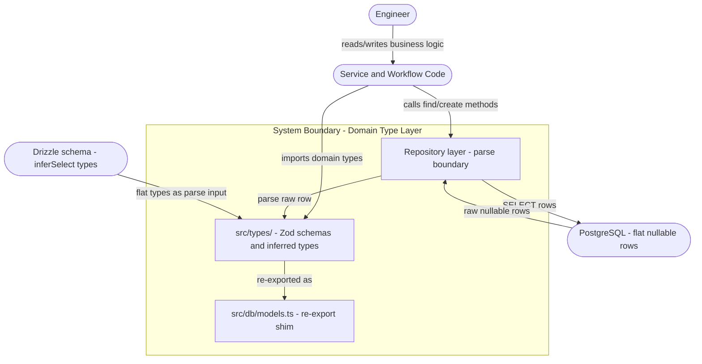

# Use Case Document: Zod Discriminated Union Domain Types

---

## Reviews

| Reviewer | Status | Feedback |
|---|---|---|
| Jordan Gaston | in_progress | |

---

## 1. Scope



> Anything inside the boundary is in scope.
> The PostgreSQL schema, Drizzle schema definitions, and migration files are dependencies — not changed by this work.

---

## 2. Actors

| Actor | Type | Description |
|---|---|---|
| Engineer | Human | Writes service, workflow, and controller code; wants the type system to enforce business invariants so invalid states fail at compile time, not runtime. |
| Service/Workflow Code | System | Consumes domain types returned by repositories; dispatches on entity state via TypeScript narrowing; should never need to null-check ownership fields. |
| Repository | System | Reads raw rows from PostgreSQL via Drizzle; parses them into validated domain types before returning to callers. |

---

## 3. Use Case Index

| ID | Level | Use Case | Primary Actor | Status |
|---|---|---|---|---|
| G-01 | Goal | Make invalid entity states unrepresentable | — | Draft |
| G-02 | Goal | Enforce parse boundary at repository layer | — | Draft |
| F-01 | Flow | Read an entity with a natural discriminant field | Repository | Not Started |
| F-02 | Flow | Read an entity with a computed discriminant field | Repository | Not Started |
| F-03 | Flow | Narrow a discriminated domain type in application code | Service/Workflow Code | Not Started |
| F-04 | Flow | Handle a schema parse failure at the repository boundary | Repository | Not Started |
| F-05 | Flow | Add a new variant to an existing discriminated union | Engineer | Not Started |
| O-01 | Op | Compute ownership discriminant for a PhoneNumber row | — | Not Started |
| O-02 | Op | Compute sender discriminant for an Email row | — | Not Started |
| O-03 | Op | Compute speaker discriminant for a CallTranscriptEntry row | — | Not Started |
| O-04 | Op | Parse a raw DB row into a discriminated domain type | — | Not Started |

---

## 4. Use Cases

### G-01: Make Invalid Entity States Unrepresentable

**Business Outcome:**
No application code can construct or receive a domain object in an invalid state — for example, a `PhoneNumber` row with two ownership foreign keys set, or a `FailedCall` without a `failureReason`. The TypeScript compiler enforces these invariants at the call site; no runtime null-checks are required to guard against impossible configurations.

**Flows:**
- F-01: Read an entity with a natural discriminant field
- F-02: Read an entity with a computed discriminant field
- F-03: Narrow a discriminated domain type in application code
- F-05: Add a new variant to an existing discriminated union

---

### G-02: Enforce Parse Boundary at Repository Layer

**Business Outcome:**
All domain types that cross the DB→application boundary pass through a single Zod parse step inside the repository. Once a value has a domain type, all callers treat it as trusted. Schema drift between the database and the type definitions surfaces immediately as a thrown `ZodError` at the repository layer, not as a silent `undefined` access deep in business logic.

**Flows:**
- F-01: Read an entity with a natural discriminant field
- F-02: Read an entity with a computed discriminant field
- F-04: Handle a schema parse failure at the repository boundary

---

### F-01: Read an Entity with a Natural Discriminant Field

```
Level:         Flow
Primary Actor: Repository
```

**Jobs to Be Done**

Repository:
  When a caller requests an entity whose table has a literal-valued
  discriminator column (e.g. `state`, `status`, `type`),
  I want to return a fully-typed discriminated domain object,
  so callers can use TypeScript narrowing instead of null-checks.

Service/Workflow Code:
  When I receive an entity from a repository,
  I want the type to reflect only the fields valid for its current state,
  so the compiler prevents me from accessing fields that don't exist in that state.

System:
  Every row retrieved from the database must pass Zod schema validation
  before it is returned to a caller. Callers must never receive a raw Drizzle row.

**Preconditions**
- The entity's table has at least one column whose value is always a member of a fixed literal set (e.g. `call.state: 'waiting' | 'connecting' | 'connected' | 'finished' | 'failed'`).
- A `z.discriminatedUnion` schema exists in `src/types/` for the entity, keyed on that column.
- The Zod schema's literal values cover every enum value the database column can hold.

**Success Guarantee**
- The repository method returns a value typed as the discriminated union (e.g. `Call`).
- The returned value's TypeScript type correctly narrows when the caller switches on the discriminant field.
- Fields that are only valid in a given variant (e.g. `failureReason` on `FailedCall`) are non-nullable on that variant and absent or `null` on others.

**Main Success Scenario**

| Step | Actor/System | Action |
|------|--------------|--------|
| 1 | Service Code | Calls `callRepository.findById(id)` |
| 2 | Repository | Executes Drizzle `select()` query; receives a raw flat row |
| 3 | Repository | Calls O-04 (Parse Raw Row) with the row and the `CallSchema` |
| 4 | O-04 | Runs `CallSchema.parse(row)`; the discriminant key `state` selects the correct variant |
| 5 | Repository | Returns the parsed `Call` typed value to the caller |
| 6 | Service Code | Switches on `call.state` and accesses variant-specific fields with full type safety |

**Extensions**

```
3a. The raw row's discriminant value is not covered by any variant literal:
    1. O-04 throws a ZodError (see F-04 for handling)
    → Flow ends in failure; caller receives a thrown error

    Example: A `call.state` value of 'archived' not present in CallSchema
    → ZodError: "Invalid discriminator value. Expected 'waiting' | 'connecting' | ..."

4a. The raw row is missing a required field on the selected variant:
    1. O-04 throws a ZodError identifying the missing field
    → Flow ends in failure; see F-04

    Example: A FailedCall row with null failureReason (required on FailedCallSchema)
    → ZodError: "Required" at path ["failureReason"]

1a. The entity does not exist (findById returns undefined):
    1. Repository returns undefined without calling O-04
    → Flow ends; caller handles undefined

    Example: findById(999) → undefined (no ZodError involved)
```

**Constraints**
- BR-01: Every discriminant literal in a Zod schema must correspond exactly to a value the database enum can produce.
- BR-02: Fields that are only meaningful in a given variant must be `z.string()` (non-nullable) in that variant's schema and `z.null()` in all others.

**Open Questions**
- [ ] Should `findAll*` methods return `Array<Call>` (union) or keep per-state types separate (e.g. `FinishedCall[]`)? Design doc should decide.

---

### F-02: Read an Entity with a Computed Discriminant Field

```
Level:         Flow
Primary Actor: Repository
```

**Jobs to Be Done**

Repository:
  When a caller requests an entity whose ownership or sender is determined
  by which foreign key column is non-null (not by a dedicated discriminator column),
  I want to inject a computed discriminant before parsing,
  so the Zod schema can use `z.discriminatedUnion` and callers receive a narrowed type.

Service/Workflow Code:
  When I receive a `PhoneNumber`, `Email`, or `CallTranscriptEntry`,
  I want the type to reflect who owns or sent it without checking multiple nullable FK fields,
  so I can write exhaustive switch statements over a single discriminant.

System:
  The computed discriminant is a transient field used only during parsing;
  it must not be stored in the database or returned as part of the persisted record structure.

**Preconditions**
- The entity's table has two or more nullable FK columns where at most one is non-null at a time (e.g. `phone_numbers.userId`, `phone_numbers.endUserId`, `phone_numbers.botId`, `phone_numbers.contactId`).
- A discriminant-computation operation exists (O-01, O-02, or O-03) for the entity.
- A `z.discriminatedUnion` schema exists in `src/types/` keyed on the computed discriminant field.

**Success Guarantee**
- The repository method returns a value typed as the discriminated union (e.g. `PhoneNumber`).
- The computed discriminant field is present in the returned type and matches the populated FK.
- All FK fields that are `null` in the selected variant are typed as `null`, not `number | null`.

**Main Success Scenario**

| Step | Actor/System | Action |
|------|--------------|--------|
| 1 | Service Code | Calls `phoneNumberRepository.findById(id)` |
| 2 | Repository | Executes Drizzle `select()` query; receives raw flat row |
| 3 | Repository | Calls O-01 (Compute Ownership Discriminant) on the raw row |
| 4 | O-01 | Returns the row extended with `ownerType: 'user' | 'bot' | 'end_user' | 'contact' | 'unowned'` |
| 5 | Repository | Calls O-04 (Parse Raw Row) with the extended row and `PhoneNumberSchema` |
| 6 | O-04 | Runs `PhoneNumberSchema.parse(extendedRow)`; selects variant via `ownerType` |
| 7 | Repository | Returns the parsed `PhoneNumber` typed value |
| 8 | Service Code | Switches on `phoneNumber.ownerType` and accesses the correct FK field |

**Extensions**

```
3a. Multiple FK columns are non-null simultaneously (data integrity violation):
    1. O-01 detects the condition and throws a ZodError
    → Flow ends in failure; see F-04

    Example: Row has both userId=5 and botId=3 non-null
    → Error: "PhoneNumber row has multiple ownership FKs set: userId, botId"

3b. All FK columns are null (unowned number):
    1. O-01 returns ownerType = 'unowned'
    2. O-04 parses successfully against the UnownedPhoneNumberSchema variant
    → Flow continues from step 7; caller receives an UnownedPhoneNumber

    Example: Row with no FK set and companyId=2
    → UnownedPhoneNumber { ownerType: 'unowned', companyId: 2, ... }

*a. The discriminant computation function encounters a row shape it does not recognize:
    1. Function throws a ZodError with a descriptive message
    → Flow ends in failure; see F-04

    Example: Unexpected null in a required column → ZodError at repository boundary
```

**Constraints**
- BR-03: At most one of `userId`, `endUserId`, `botId`, `contactId` may be non-null on any `phone_numbers` row.
- BR-04: At most one of `endUserId`, `botId`, `userId` may be non-null on any `emails` row or `call_transcript_entries` row.
- BR-05: The computed discriminant field name must not collide with any column name on the underlying table.

**Open Questions**
- [ ] Should computed discriminant fields be visible in the returned type (e.g. `phoneNumber.ownerType`) or hidden behind accessors? The design doc should decide.
- [ ] For `Email`, should the discriminant be `senderType` or use the existing `direction` field combined with a sender field? Design doc should resolve.

---

### F-03: Narrow a Discriminated Domain Type in Application Code

```
Level:         Flow
Primary Actor: Service/Workflow Code
```

**Jobs to Be Done**

Service/Workflow Code:
  When I receive a domain entity that can be in one of several states,
  I want to switch on its discriminant field and access only the fields
  valid for that state,
  so the TypeScript compiler prevents me from accessing fields that
  only exist on a different variant.

Engineer:
  When I write a switch over an entity's discriminant,
  I want the compiler to warn me if I forget to handle a variant,
  so new variants added to the union automatically produce a compile error
  in code that doesn't handle them.

System:
  When a discriminated union receives a new variant, all switch statements
  over that union that do not include the new case must produce a TypeScript error.

**Preconditions**
- The caller holds a value typed as a discriminated union (e.g. `Call`, `PhoneNumber`, `Attachment`).
- The value was obtained from a repository method and has already been parsed.

**Success Guarantee**
- Within each branch of the switch, the TypeScript type is narrowed to the specific variant.
- Fields that do not exist on the narrowed variant produce a compile-time error if accessed.
- An unhandled `default` branch with `assertNever(x)` produces a compile-time error when a new variant is added and no case covers it.

**Main Success Scenario**

| Step | Actor/System | Action |
|------|--------------|--------|
| 1 | Service Code | Receives a `Call` value from a repository method |
| 2 | Service Code | Writes a `switch` statement on `call.state` |
| 3 | TypeScript | Narrows the type in each `case` branch to the specific variant |
| 4 | Service Code | Accesses variant-specific fields (e.g. `call.failureReason` only in the `failed` case) |
| 5 | TypeScript | Emits a compile error if `call.failureReason` is accessed outside the `failed` case |

**Extensions**

```
2a. The switch does not cover all variants and has no default branch with assertNever:
    1. TypeScript does not error (no exhaustiveness check unless assertNever is used)
    → Engineer must add assertNever(call) in the default branch to opt into exhaustiveness

    Example: switch missing 'waiting' case + no default → compiles without error
    → With assertNever: compile error "Argument of type 'WaitingCall' is not assignable to parameter of type 'never'"

2b. Engineer accesses a nullable field without narrowing:
    1. TypeScript emits a type error because the field is typed as null on the current variant
    → Engineer adds a case branch or non-null assertion

    Example: call.failureReason.length outside the 'failed' case
    → TypeScript: "Cannot read properties of null"
```

**Constraints**
- BR-06: All switch statements over discriminated union types should include a `default: assertNever(x)` branch to enforce exhaustiveness.

**Open Questions**
- [ ] Should `assertNever` be added to a shared utility file, or should callers import it from a library? Design doc should specify.

---

### F-04: Handle a Schema Parse Failure at the Repository Boundary

```
Level:         Flow
Primary Actor: Repository
```

**Jobs to Be Done**

Repository:
  When Zod parse fails on a raw DB row,
  I want the error to propagate as an unhandled exception,
  so it surfaces immediately as a programming error (schema drift) rather than
  being silently swallowed and corrupting downstream logic.

Engineer:
  When a schema parse failure occurs in production,
  I want a structured error with the Zod path and message,
  so I can identify which column and row caused the drift.

System:
  Parse failures at the repository boundary are programming errors, not user errors.
  They indicate that the database schema has drifted from the Zod schema.
  They must never be caught and swallowed at the repository layer.

**Preconditions**
- A repository method has retrieved a raw row from the database.
- The raw row does not conform to the Zod schema (wrong value, missing required field, or unrecognized discriminant).

**Success Guarantee**
- A `ZodError` is thrown and propagates up the call stack.
- The `ZodError` includes the discriminant value (if present), the failing path, and the Zod error message.
- No partial or invalid domain object is returned.

**Main Success Scenario**

| Step | Actor/System | Action |
|------|--------------|--------|
| 1 | Repository | Calls `Schema.parse(row)` via O-04 |
| 2 | Zod | Detects schema violation; throws `ZodError` |
| 3 | Repository | Does not catch the error; it propagates to the caller |
| 4 | Middleware | Global error handler catches the `ZodError` and logs it with context |
| 5 | System | Returns a 500 to the HTTP caller (if in a request context) or crashes the workflow |

**Extensions**

```
2a. The ZodError occurs because a new database enum value was added without updating the Zod schema:
    1. ZodError message: "Invalid discriminator value. Expected 'pending' | 'stored' | 'failed', received 'archived'"
    → Flow ends in failure; engineer must add the new variant to the Zod schema

    Example: status='archived' row from DB → ZodError at discriminant check

2b. The ZodError occurs because a column that should never be null is null (data integrity issue):
    1. ZodError message: "Required" at path ["storageKey"] for a 'stored' attachment
    → Flow ends in failure; indicates a bug in the write path that allowed an invalid row

    Example: Attachment with status='stored' but storageKey=null → ZodError path ["storageKey"]
```

**Constraints**
- BR-07: Repositories must use `.parse()`, not `.safeParse()`. Schema parse failures are programming errors and must not be caught at the repository layer.
- NFR-01: ZodErrors at the repository boundary must include the table name, row ID, and Zod issue path in their log context.

**Open Questions**
- [ ] None — this behavior is unambiguous.

---

### F-05: Add a New Variant to an Existing Discriminated Union

```
Level:         Flow
Primary Actor: Engineer
```

**Jobs to Be Done**

Engineer:
  When the domain model requires a new entity state (e.g. a new call state or attachment status),
  I want the process of adding the new variant to be guided by compile errors,
  so I cannot forget to handle the new case in any existing switch statement.

System:
  When a new variant is added to a discriminated union, every `switch` statement
  with an `assertNever` default must produce a TypeScript compile error until
  the new case is handled.

**Preconditions**
- A new enum value has been added to the database schema (or is being added).
- The existing Zod schema in `src/types/` does not yet include the new variant.

**Success Guarantee**
- The new variant schema is defined in `src/types/<entity>.ts`.
- The new variant is added to the `z.discriminatedUnion` options array.
- All existing `switch` statements without a handler for the new case produce TypeScript compile errors.
- All tests pass after new variant handlers are added.

**Main Success Scenario**

| Step | Actor/System | Action |
|------|--------------|--------|
| 1 | Engineer | Adds new enum value in the Drizzle schema and generates a migration |
| 2 | Engineer | Defines a new `z.object()` variant schema in `src/types/<entity>.ts` |
| 3 | Engineer | Adds the new schema to the `z.discriminatedUnion` options array |
| 4 | TypeScript | Emits compile errors in all `switch` statements with `assertNever` defaults that don't handle the new case |
| 5 | Engineer | Adds handlers for the new variant in each flagged switch statement |
| 6 | System | Compiles cleanly; all tests pass |

**Extensions**

```
4a. Some switch statements do not have an assertNever default:
    1. TypeScript does not warn; those sites become silent gaps
    → Engineer must add assertNever to the default branch to opt in to exhaustiveness

    Example: switch(attachment.status) { case 'pending': ... case 'stored': ... }
    without default → compiles even after adding 'archived' variant; silent gap

3a. The new variant requires a DB migration that hasn't run yet:
    1. Zod schema is updated but the migration hasn't been applied
    2. The old enum constraint in the DB rejects the new value
    → Parse failures occur at runtime if old rows are fetched while new schema is deployed
    → Coordinate migration and deploy order per CLAUDE.md deployment rules
```

**Constraints**
- BR-01: Every discriminant literal in a Zod schema must correspond exactly to a value the database enum can produce.
- BR-08: New variant schemas must be tested with at least one unit test in `src/types/__tests__/` that parses a representative row and asserts the narrowed type.

**Open Questions**
- [ ] Should a lint rule enforce `assertNever` in all switch statements over union types? Design doc should recommend.

---

### O-01: Compute Ownership Discriminant for PhoneNumber Rows

Receives a raw `phone_numbers` select row (with `userId`, `endUserId`, `botId`, `contactId` as `number | null`).

Inspects all four FK columns and determines which, if any, is non-null. Returns the row extended with an `ownerType` field set to `'user'`, `'bot'`, `'end_user'`, `'contact'`, or `'unowned'`.

Returns: `RawPhoneNumberRow & { ownerType: PhoneNumberOwnerType }`.

Failure cases:
- If more than one FK column is non-null, throws with message: `"PhoneNumber row ${id} has multiple ownership FKs set: [fieldNames]"`.

Called by:
- F-02 at step 3

---

### O-02: Compute Sender Discriminant for Email Rows

Receives a raw `emails` select row (with `endUserId`, `botId`, `userId` as `number | null`).

Inspects all three sender FK columns and determines which is non-null. Returns the row extended with a `senderType` field set to `'end_user'`, `'bot'`, or `'user'`.

Returns: `RawEmailRow & { senderType: EmailSenderType }`.

Failure cases:
- If more than one sender FK is non-null, throws with message: `"Email row ${id} has multiple sender FKs set: [fieldNames]"`.
- If all sender FKs are null, throws with message: `"Email row ${id} has no sender FK set"` (DB check constraint should prevent this, but parse boundary must catch it).

Called by:
- F-02 at step 3 (for Email entities)

---

### O-03: Compute Speaker Discriminant for CallTranscriptEntry Rows

Receives a raw `call_transcript_entries` select row (with `endUserId`, `botId`, `userId` as `number | null`).

Inspects all three speaker FK columns and determines which is non-null. Returns the row extended with a `speakerType` field set to `'end_user'`, `'bot'`, or `'user'`.

Returns: `RawCallTranscriptEntryRow & { speakerType: TranscriptSpeakerType }`.

Failure cases:
- If more than one speaker FK is non-null, throws with message: `"CallTranscriptEntry row ${id} has multiple speaker FKs set: [fieldNames]"`.
- If all speaker FKs are null, throws with message: `"CallTranscriptEntry row ${id} has no speaker FK set"`.

Called by:
- F-02 at step 3 (for CallTranscriptEntry entities)

---

### O-04: Parse a Raw DB Row into a Discriminated Domain Type

Receives a raw row object (from a Drizzle `select()` result, optionally extended with a computed discriminant) and a Zod discriminated union schema.

Calls `Schema.parse(row)`. Zod checks the discriminant key, selects the matching variant, validates all fields on that variant, and returns the typed domain object.

Returns: `z.infer<typeof Schema>` — the fully validated domain type.

Failure cases:
- If the discriminant value is not present in any variant's literal, throws `ZodError` with an "Invalid discriminator value" message.
- If the selected variant's required fields are missing or of the wrong type, throws `ZodError` with the failing path.
- Never returns a partial result; either returns the fully validated object or throws.

Called by:
- F-01 at step 3
- F-02 at step 5

---

## 5. Appendix A — Non-Functional Requirements

| ID | Category | Constraint |
|---|---|---|
| NFR-01 | Observability | When a ZodError is thrown at the repository boundary, the system shall log the table name, row ID, and Zod issue path before the error propagates. |
| NFR-02 | Compile-time safety | All discriminated union switch statements in application code shall include a `default: assertNever(x)` branch so that adding a new variant produces a compile error at every unhandled call site. |
| NFR-03 | Test coverage | Every Zod schema in `src/types/` shall have unit tests covering: the happy path for each variant, a test that a row with invalid discriminant throws, and a test that a valid variant's required fields are enforced. |

---

## 6. Appendix B — Business Rules

| ID | Rule |
|---|---|
| BR-01 | Every discriminant literal in a Zod schema must correspond exactly to a value the database enum column can produce. No Zod-only or DB-only literals. |
| BR-02 | Fields that are only meaningful in a given variant must be typed as non-nullable (`z.string()`, `z.number()`) in that variant's schema and as `z.null()` in all other variants' schemas. |
| BR-03 | At most one of `phone_numbers.userId`, `endUserId`, `botId`, `contactId` may be non-null on any given row. |
| BR-04 | Exactly one of `emails.endUserId`, `botId`, `userId` must be non-null on any given row (enforced by DB check constraint). |
| BR-05 | Computed discriminant field names (`ownerType`, `senderType`, `speakerType`) must not collide with any column name on the underlying table. |
| BR-06 | All switch statements over discriminated union types must include a `default: assertNever(x)` branch to enforce compile-time exhaustiveness. |
| BR-07 | Repositories must use `.parse()`, not `.safeParse()`. Parse failures at the repository boundary are programming errors and must propagate unhandled. |
| BR-08 | Every new variant added to a discriminated union must have a unit test in `src/types/__tests__/` that parses a representative raw row fixture and asserts the narrowed type. |

---

## 7. Appendix C — Data Dictionary

| Field | Type | Constraints | Notes |
|---|---|---|---|
| `ownerType` | `'user' \| 'bot' \| 'end_user' \| 'contact' \| 'unowned'` | computed, non-persisted | Injected by O-01 before parsing a `phone_numbers` row |
| `senderType` | `'end_user' \| 'bot' \| 'user'` | computed, non-persisted | Injected by O-02 before parsing an `emails` row |
| `speakerType` | `'end_user' \| 'bot' \| 'user'` | computed, non-persisted | Injected by O-03 before parsing a `call_transcript_entries` row |
| Natural discriminant | existing column | literal enum, persisted | Used directly by: `call.state`, `sms_message.state`, `attachment.status`, `subdomain.status`, `call_participant.type`, `chat.channel` |

---

## Appendix D — Changelog

| Date | Author | Change |
|---|---|---|
| 2026-04-10 | Jordan Gaston | Initial draft |
